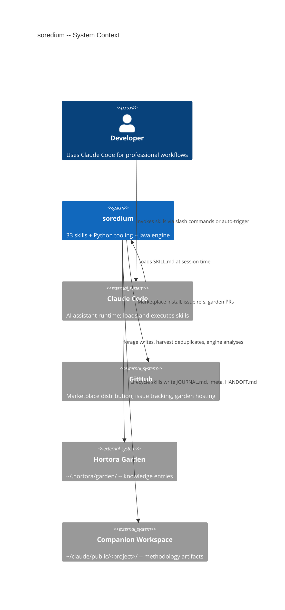
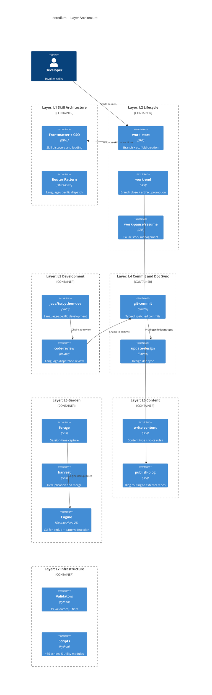
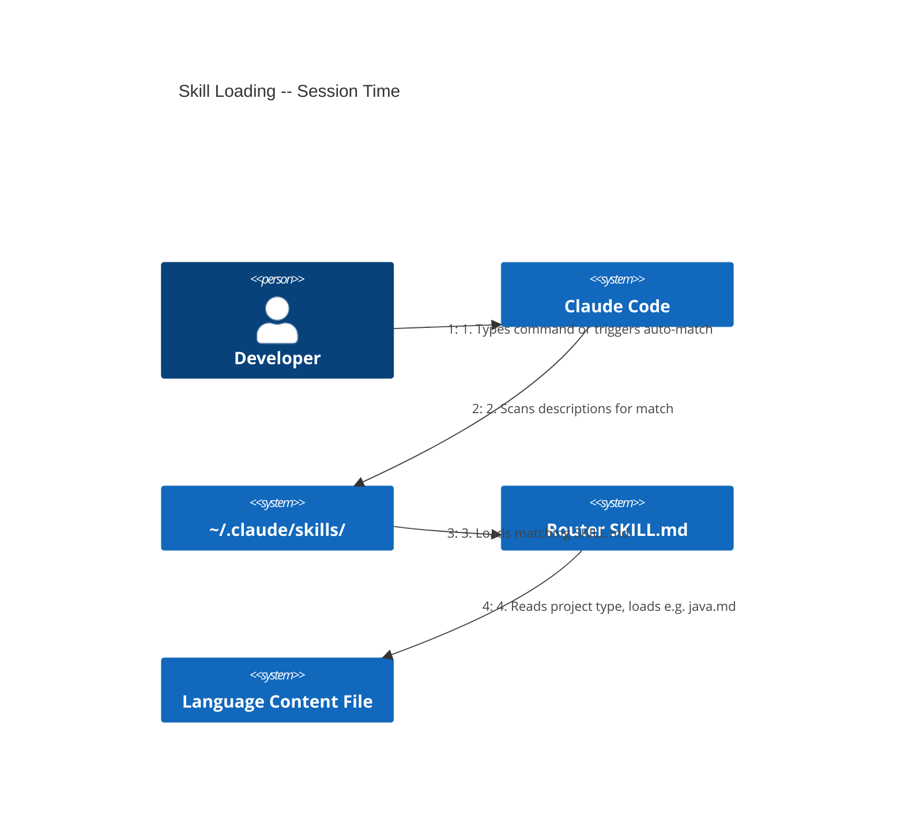
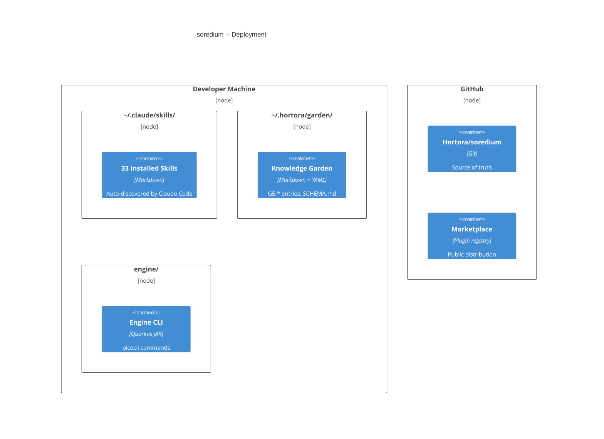
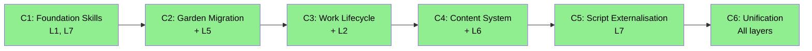

# ARC42STORIES.MD -- soredium

Architecture documentation for the soredium skill collection, garden tooling, and engine.
Follows the [Arc42Stories specification](docs/arc42stories-spec.md).

---

## Artifact Schema

| Artifact type | Format | Example | Where it lives |
|---|---|---|---|
| Issue / work item | `#NNN` | `#129` | GitHub Issues (Hortora/soredium) |
| ADR | `ADR-NNNN` | `ADR-0007` | `docs/adr/` |
| Garden entry | `GE-YYYYMMDD-XXXXXX` | `GE-20260521-e39ad1` | `~/.hortora/garden/` |
| Blog entry | `YYYY-MM-DD-title` | `2026-05-19-layer-5-lands` | hortora.github.io `_posts/` |
| Protocol | `<slug>.md` | `externalised-scripts-require-tests.md` | `docs/protocols/` |
| Skill | `<name>/SKILL.md` | `forage/SKILL.md` | Repository root |

---

## S1 Introduction and Goals

**What soredium is:** A Claude Code skill collection (33 skills), Python tooling (~65 scripts, 5 utility modules, 20 validators, ~2010 tests), and a Quarkus/Java 21 engine (52 Java files) for garden deduplication and pattern detection.

Named after the lichen's dispersal unit -- a self-contained bundle carrying everything needed to establish a new colony wherever it lands.

**GitHub:** [Hortora/soredium](https://github.com/Hortora/soredium)
**Marketplace:** `/plugin marketplace add github.com/Hortora/soredium`

### Stakeholders

| Stakeholder | Interest |
|---|---|
| Developers using Claude Code | Consistent, correct development workflows across project types |
| Skill authors (contributors) | Clear architecture, testable skills, documented conventions |
| Hortora garden users | Capture, deduplicate, and mine patterns from development experience |

### Quality Goals

| Priority | Goal | Measured by |
|---|---|---|
| 1 | Token efficiency | Router pattern loads only relevant content; lazy file reads; no cross-language waste |
| 2 | Correctness | 2010 tests, 19 validators across 3 tiers, functional tests per skill |
| 3 | Universality | Skills work across 5 project types (skills, java, blog, custom, generic) without type-specific hacks |

---

## S2 Constraints

| Constraint | Source | Impact |
|---|---|---|
| Auto-discovery from `~/.claude/skills/` | Claude Code runtime | Skills must be real directories (not symlinks); each needs `SKILL.md` with YAML frontmatter |
| Marketplace plugin format | `.claude-plugin/marketplace.json` | All published skills listed with name + description; `commands/` directory required for slash commands |
| Skills are markdown | Claude Code spec | No executable code in SKILL.md; skills reference bundled `.py` or `.sh` scripts for mechanical operations |
| Garden at `~/.hortora/garden/` | Hortora convention | `HORTORA_GARDEN` env var; sparse blobless clone; `SCHEMA.md` for federation |
| No AI attribution in commits | ADR-0005 | Commit messages describe WHAT and WHY only; no `Co-Authored-By`, no `Generated-by` |
| Project type declared in CLAUDE.md | ADR-0009 | Every consuming project declares `type: skills|java|blog|custom|generic`; routing depends on it |

---

## S3 Context and Scope

### System Context



### External Interfaces

| Interface | Direction | What crosses |
|---|---|---|
| Claude Code skill loader | Inbound | SKILL.md files read at session start; description field triggers loading |
| GitHub Marketplace | Outbound | `marketplace.json` declares installable skills |
| GitHub Issues | Bidirectional | `issue-workflow` creates/closes issues; `git-commit` references them |
| Hortora Garden | Bidirectional | `forage` writes entries; `harvest` merges/deduplicates; `validate_pr.py` checks PRs |
| Companion workspace | Outbound | `work-start` scaffolds `.meta`; `work-end` merges JOURNAL.md; `handover` writes HANDOFF.md |
| Engine CLI | Internal | `picocli` commands for harvest, mine, QE matrix operations |

---

## S4 Solution Strategy

### Core Architectural Patterns

**Router pattern for language-specific content.**
**Before:** Each language variant was a separate skill (java-code-review, ts-code-review, python-code-review) -- 3 skills loaded for one concern, most content wasted.
**After:** One `code-review/SKILL.md` dispatches to `java.md`, `typescript.md`, or `python.md` based on the project's declared type. Only the relevant content file loads.

What this changes:
- **Token cost drops by ~66%** -- two unused language files never load
- **Adding a language** -- add a content file + update the dispatch table; no new skill registration
- **Consistency** -- shared rules live in the router SKILL.md; language-specific rules live in content files

**Workspace-as-CWD model.**
**Before:** Claude opens in the project repo; third-party skills write artifacts into tracked source directories.
**After:** Claude opens in the companion workspace (`~/claude/public/<project>/`); the project repo is loaded via `add-dir`. All skills -- including third-party -- write to CWD (the workspace), not the project repo.

What this changes:
- **Methodology artifacts stay out of project git history** -- plans, snapshots, handovers land in workspace
- **Third-party skill compatibility** -- skills that write to CWD hit workspace, not project
- **Navigation** -- `proj/` symlink in workspace points to project; `wksp/` in project points back

**Exception:** soredium itself does not use the workspace model. Its CLAUDE.md is a public artifact committed to the repo. Opening Claude in the project directory is the correct workflow.

**Claude Search Optimization (CSO).**
The `description` field in SKILL.md frontmatter controls when Claude loads the skill. CSO rules (ADR-0004):
- Start with "Use when..." -- triggering conditions, not workflow summaries
- Describe the problem or symptoms, not the solution
- Under 500 characters; third person only
- If the description summarises the workflow, Claude follows the description instead of reading the full skill body

**Workspace mode detection** (corrected). Previously checked `epic-*` branch prefix -- silently bypassed the journal for `issue-NNN-*` branches. Now checks three conditions: `.meta` exists, `JOURNAL.md` exists, workspace not on main. Branch name prefix plays no part. (Refs #94)

**Routing decision stability.** `design-repo: project|workspace` is stored in `.meta` at branch creation (`work-start` Step 8) and read verbatim at close (`work-end` Step 3). Re-deriving from routing config at close time is incorrect -- config may have changed between sessions, producing a different answer. (Refs #94)

### Chapter Sequencing Rationale

- C1 before C2: C1 establishes skill architecture conventions (frontmatter, CSO, naming) that C2's garden skills must follow
- C2 before C3: C2 delivers `forage`/`harvest` which C3's lifecycle skills reference for session-time capture
- C3 before C4: C3 delivers `work-start`/`work-end` which C4's `write-content` chains into via `handover`
- C4 and C5 independent: C5 (externalisation) touches all skills mechanically but does not change behavior
- C5 before C6: C6 (merge) requires stable skill scripts that C5 externalises

---

## S5 Building Block View

### Layer Architecture



### Skill Categories

| Category | Count | Skills |
|---|---|---|
| Lifecycle | 6 | `work`, `work-start`, `work-end`, `work-pause`, `work-resume`, `workspace-init` |
| Development | 3 | `java-dev`, `ts-dev`, `python-dev` |
| Quality | 4 | `code-review`, `security-audit`, `project-health`, `project-refine` |
| Commits and Docs | 7 | `git-commit`, `git-squash`, `update-design`, `update-claude-md`, `implementation-doc-sync`, `adr`, `issue-workflow` |
| Garden | 3 | `forage`, `harvest`, `protocol` |
| Content | 4 | `write-content`, `publish-blog`, `handover`, `idea-log` |
| Infrastructure | 6 | `project`, `dependency-update`, `retro-issues`, `sync-local`, `fix-ci`, `ide-tooling` |

### Python Scripts

| Directory | Count | Purpose |
|---|---|---|
| `scripts/validation/` | 20 | COMMIT/PUSH/CI tier validators |
| `scripts/utils/` | 5 | `common.py`, `markdown_patterns.py`, `markdown_utils.py`, `skill_parser.py`, `yaml_utils.py` |
| `scripts/` (root) | ~40 | Garden tooling, pipeline, web installer, sync, generation |

### Engine (Quarkus/Java 21)

| Package | Key files | Purpose |
|---|---|---|
| `io.hortora.garden.engine` | `SemanticDeduplicator`, `FeatureExtractor`, `ClusterPipeline` | Core dedup + pattern detection |
| `io.hortora.garden.engine.ai` | `DedupeClassifier`, `EntryMergeService`, `PatternNamingService` | LangChain4j AI services |
| `io.hortora.garden.engine.cli` | `GardenEngineCommand`, `HarvestCommand`, `MineCommand`, `QECommand` | picocli CLI entry points |

---

## S6 Runtime View

Skills load at session time -- they are not compiled or executed. Claude reads `SKILL.md` into its context window when the description field matches the user's request or when invoked via slash command.

### Skill Loading Sequence



### Engine CLI Invocation

The engine runs as a picocli CLI application. `harvest` invokes it for deduplication; `mine` orchestrates the ecosystem pipeline.

```bash
# Direct CLI
java -jar engine/target/quarkus-app/quarkus-run.jar harvest --garden ~/.hortora/garden/
java -jar engine/target/quarkus-app/quarkus-run.jar mine --registry registry/projects.yaml
```

### Garden Agent Post-Commit Flow

`forage CAPTURE` writes a garden entry to `~/.hortora/garden/entries/`. `validate_pr.py` checks schema compliance. `integrate_entry.py` updates indexes and commits.

---

## S7 Deployment View

### Installation Methods

| Method | Command | Target |
|---|---|---|
| Marketplace plugin | `/plugin marketplace add github.com/Hortora/soredium` | `~/.claude/plugins/cache/` |
| Developer sync | `python3 scripts/claude-skill sync-local --all -y` | `~/.claude/skills/` |
| Manual clone | `git clone https://github.com/Hortora/soredium` | Any directory |

### Deployment Topology



### File Layout

| Path | What it contains |
|---|---|
| `<skill-name>/SKILL.md` | Skill definition (frontmatter + workflow) |
| `<skill-name>/commands/` | Slash command registration |
| `<skill-name>/*.md` | Content files for router skills |
| `<skill-name>/defaults/` | Bundled rules loaded regardless of user config |
| `<skill-name>/scripts/` | Externalised Python/Bash scripts |
| `scripts/` | Validators, utilities, pipeline, web installer |
| `engine/` | Quarkus/Java 21 subproject |
| `docs/adr/` | Architecture Decision Records |
| `docs/protocols/` | Standing rules and conventions |
| `.claude-plugin/marketplace.json` | Marketplace skill listing |

---

## S8 Crosscutting Concepts

| Concern | Reference | One-line description |
|---|---|---|
| CSO rules | ADR-0004, CLAUDE.md -- Frontmatter Requirements | `description` field: triggering conditions only, never workflow summaries |
| Token efficiency | CLAUDE.md -- Skill Architecture | Router pattern, lazy content file loading, no cross-language waste |
| No AI attribution | ADR-0005, CLAUDE.md -- No AI Attribution | Commit messages: WHAT and WHY only; no Co-Authored-By or Generated-by |
| Workspace model | DESIGN.md -- Workspace Model, CLAUDE.md -- Workspace Model | Workspace as CWD; project via add-dir; `proj/` and `wksp/` symlinks |
| Project type routing | ADR-0009, docs/PROJECT-TYPES.md | 5 types (skills, java, blog, custom, generic); declared in CLAUDE.md |
| Canonical path resolution | CLAUDE.md -- Canonical Path Resolution Block | `readlink -f proj` for project; `readlink -f wksp` for workspace; never parse CLAUDE.md |
| Issue tracking | CLAUDE.md -- Work Tracking | Step 0b in all commit skills; `Refs #N` or `Closes #N` in every message |
| Foundation skills | ADR-0006 | Generic principles (`code-review-principles`, etc.) never invoked directly; referenced via Prerequisites |
| Document validation | ADR-0010 | Universal validators prevent sync corruption; 3 tiers (COMMIT < 2s, PUSH < 30s, CI < 5min) |
| Blog four-layer architecture | DESIGN.md -- write-blog Architecture | L1 mandatory craft, L2 CLAUDE.md inference, L3 voice defaults, L4 invocation overrides |
| Subtype taxonomy | ADR-0011, Protocol: taxonomy-values-reflect-content-character | `subtype: diary` (not `log`); values describe content character, not form |
| Modular docs | ADR-0003 | Skills-repo logic in `docs/development/`, not portable skills; zero token cost in other project types |
| Skills-specific workflows | ADR-0008 | `skill-validation.md` and `readme-sync.md` modularised; `git-commit` loads them for `type: skills` only |

### Anti-Patterns

**Symptom:** Skill description says "dispatches subagent per task with code review between tasks."
**Cause:** Description summarises the workflow instead of describing triggering conditions.
**Fix:** Rewrite to "Use when executing implementation plans with independent tasks in the current session." CSO descriptions answer *when*, not *how*.

**Symptom:** `java-update-design` silently writes to DESIGN.md instead of JOURNAL.md on `issue-NNN-*` branches.
**Cause:** Workspace mode detection checked for `epic-*` branch prefix. New naming convention uses `issue-NNN-*`.
**Fix:** Detect workspace mode via `.meta` + `JOURNAL.md` + not-on-main. Branch name prefix must never be part of detection. (Refs #94)

**Symptom:** `work-end` merges JOURNAL.md into the wrong DESIGN.md (workspace vs project).
**Cause:** Routing config re-derived at close time; config changed since branch creation.
**Fix:** Read `design-repo` from `.meta` (written at branch creation). Never re-derive at close. (Refs #94)

**Symptom:** `work-pause` writes `.paused` marker but push fails -- orphaned `.paused` on main with no matching branch state.
**Cause:** `.paused` written before confirming push success.
**Fix:** Step 3 push must succeed before Step 4 writes `.paused`. Atomic ordering: commit -> push -> mark.

**Symptom:** `stash pop` restores wrong state after `work-resume`.
**Cause:** Bare `stash pop` pops position 0, which may be a manual stash the user created between pause and resume.
**Fix:** Record `stash@{N}` at pause; `work-resume` pops by reference, not position.

**Symptom:** Skills installed as symlinks in `~/.claude/skills/` are silently ignored.
**Cause:** Claude Code does not follow symlinks in the skills directory.
**Fix:** Copy skill content into `~/.claude/skills/<name>/` as real directories. `sync-local` handles this.

---

## S9 Journeys and Chapters

### S9.1 Journey Overview

| Journey | Description | Chapters | Status |
|---|---|---|---|
| Professional Development Workflow | From session start to session end: branch creation, development, review, commit, design sync, blog, close | 6 | C1--C5 complete, C6 complete |



### S9.2 Chapter Index

| # | Chapter | Journey | Layers touched | Delta summary | Status |
|---|---|---|---|---|---|
| 1 | Foundation Skills | Professional Dev | L1, L3, L4, L7 | High, Medium, Medium, High | ✅ |
| 2 | Garden Migration | Professional Dev | + L5 | High | ✅ |
| 3 | Work Lifecycle | Professional Dev | + L2 | High | ✅ |
| 4 | Content System | Professional Dev | + L6 | High | ✅ |
| 5 | Script Externalisation | Professional Dev | L1, L7 | Medium, Medium | ✅ |
| 6 | Unification | Professional Dev | All | Low--Medium | ✅ |

**Layer x Chapter Matrix**

| Layer | C1 | C2 | C3 | C4 | C5 | C6 |
|---|---|---|---|---|---|---|
| L1 Skill Architecture | High | Low | Low | Low | Medium | Low |
| L2 Lifecycle | -- | -- | High | Low | Low | Low |
| L3 Development | Medium | -- | -- | -- | -- | Low |
| L4 Commit and Doc Sync | Medium | -- | Low | Low | Low | Low |
| L5 Garden | -- | High | -- | -- | -- | Low |
| L6 Content | -- | -- | -- | High | Low | Low |
| L7 Infrastructure | High | Medium | Low | Low | Medium | Medium |

L1 (Skill Architecture) and L7 (Infrastructure) appear in every column -- foundational, cross-cutting. L5 (Garden) and L6 (Content) show single High entries at introduction then stability -- clean boundaries.

**Sequencing rationale:**
- C1 before C2: C1 establishes frontmatter, CSO, and naming conventions that all subsequent skills follow
- C2 before C3: `forage`/`harvest` exist before lifecycle skills can chain to them
- C3 before C4: `work-start`/`work-end` must exist before `write-content` and `handover` can chain into them
- C4 and C5 independent: C5 moves mechanical code out of SKILL.md files; C4 adds content taxonomy. Neither depends on the other
- C5 before C6: merge requires stable externalised scripts, not inline bash blocks

### S9.3 Chapter Entries

### Chapter 1 -- Foundation Skills

**Journey:** Professional Dev | **Sequence:** 1 of 6 | **Status:** ✅
**Delivered:** 2026-03-29 | **Issues:** Initial commit series | **Blog:** --

**What this delivers**

After C1, Claude Code loads 9 skills covering development, code review, commits, dependency management, and design sync. A developer installs the marketplace plugin and gets language-aware workflows for Java, TypeScript, and Python projects. Validators catch broken frontmatter and CSO violations before commit.

**Accountability gaps closed**
- Consistent skill loading -> L1 Skill Architecture (frontmatter + CSO rules)
- Automated validation -> L7 Infrastructure (8 COMMIT-tier validators)

**Layer Impact**

| Layer | Delta |
|---|---|
| L1 Skill Architecture | High |
| L3 Development | Medium |
| L4 Commit and Doc Sync | Medium |
| L7 Infrastructure | High |

---

### Chapter 2 -- Garden Migration

**Journey:** Professional Dev | **Sequence:** 2 of 6 | **Status:** ✅
**Delivered:** 2026-04-08 to 2026-04-12 | **Issues:** soredium scaffold, forage/harvest deployment | **Blog:** --

**What this delivers**

After C2, the knowledge garden lives at `~/.hortora/garden/` under Hortora governance. `forage` captures entries during development sessions. `harvest` deduplicates in dedicated maintenance sessions. The legacy `garden` skill is retired. CI validates PRs via `validate_pr.py` and integrates entries via `integrate_entry.py`.

**Accountability gaps closed**
- Session-time knowledge capture -> L5 Garden (`forage` CAPTURE/SWEEP/SEARCH/REVISE)
- Entry dedup at scale -> L5 Garden (`harvest` + engine)

**Layer Impact**

| Layer | Delta |
|---|---|
| L5 Garden | High |
| L7 Infrastructure | Medium |

---

### Chapter 3 -- Work Lifecycle

**Journey:** Professional Dev | **Sequence:** 3 of 6 | **Status:** ✅
**Delivered:** 2026-04-14 | **Issues:** #94 (workspace detection fix) | **Blog:** --

**What this delivers**

After C3, four commands replace the fragmented `work-start` + `epic begin/close` workflow. `work-start` detects 6 branch states (fresh, existing, paused, orphaned, misaligned, closed) and handles each. `work-end` promotes artifacts per routing config, merges JOURNAL.md, closes the issue, and stamps the branch. `work-pause` and `work-resume` manage a pause stack with durable WIP commits (no stash position fragility).

**Accountability gaps closed**
- Consistent branch state handling -> L2 Lifecycle (6-state detection in `work-start`)
- Artifact promotion at close -> L2 Lifecycle (`work-end` routing per `.meta`)

**Layer Impact**

| Layer | Delta |
|---|---|
| L2 Lifecycle | High |
| L1 Skill Architecture | Low |
| L4 Commit and Doc Sync | Low |
| L7 Infrastructure | Low |

---

### Chapter 4 -- Content System

**Journey:** Professional Dev | **Sequence:** 4 of 6 | **Status:** ✅
**Delivered:** 2026-05-20 | **Issues:** #127, #129 | **Blog:** --

**What this delivers**

After C4, `write-content` determines content type (Note, Article, Brief, News) and applies the three-layer taxonomy (type -> subtype -> form). Anti-slop rules and mandatory voice policy load before any content generation. Blog routing via `publish-blog` cross-posts entries to external git destinations. The four-layer blog architecture (mandatory craft, CLAUDE.md inference, voice defaults, invocation overrides) separates what must not vary from what can.

**Accountability gaps closed**
- Content quality enforcement -> L6 Content (anti-slop + mandatory-rules + mode-first generation)
- Cross-posting -> L6 Content (`publish-blog` Level 2 routing via `blog-routing.yaml`)

**Layer Impact**

| Layer | Delta |
|---|---|
| L6 Content | High |
| L1 Skill Architecture | Low |
| L4 Commit and Doc Sync | Low |
| L7 Infrastructure | Low |

---

### Chapter 5 -- Script Externalisation

**Journey:** Professional Dev | **Sequence:** 5 of 6 | **Status:** ✅
**Delivered:** 2026-06-08 to 2026-06-17 | **Issues:** -- | **Blog:** --

**What this delivers**

After C5, mechanical code (bash blocks, Python one-liners) moves from SKILL.md bodies into standalone scripts under each skill's `scripts/` directory. `ctx.py` expands to handle workspace/project path resolution for all externalised scripts. 25 per-skill scripts across 11 skills. Skills shrink; scripts gain tests.

**Accountability gaps closed**
- Testable mechanical operations -> L7 Infrastructure (scripts testable independently of Claude)
- Smaller skill token cost -> L1 Skill Architecture (inline bash removed from SKILL.md)

**Layer Impact**

| Layer | Delta |
|---|---|
| L1 Skill Architecture | Medium |
| L7 Infrastructure | Medium |

---

### Chapter 6 -- Unification

**Journey:** Professional Dev | **Sequence:** 6 of 6 | **Status:** ✅
**Delivered:** 2026-06-18 | **Issues:** -- | **Blog:** --

**What this delivers**

After C6, cc-praxis and soredium merge into one repository. 31 marketplace skills, unified CLAUDE.md, unified README.md, combined test suites (~2010 tests), single `marketplace.json`. The `cc-praxis` name is retired. All references updated to `Hortora/soredium`.

**Accountability gaps closed**
- Single source of truth -> All layers (one repo, one plugin, one install command)
- No duplicate skill definitions -> L1 Skill Architecture (unified marketplace.json)

**Layer Impact**

| Layer | Delta |
|---|---|
| All layers | Low--Medium |

---

### S9.4 Layer Entries

### Layer -- L1 Skill Architecture

**Participates in chapters:** C1, C2, C3, C4, C5, C6
**Architectural patterns:** Router, Strategy (language dispatch), Convention-over-Configuration (frontmatter schema)
**Key protocols:** `docs/development/skill-validation.md`, `docs/development/readme-sync.md`
**Issues:** ADR-0004 (CSO), ADR-0008 (modularisation)
**Navigation:** `git log --grep="SKILL.md" --oneline`
**Completed:** 2026-03-29 (initial), continuously refined

#### What it adds

**Before:** No standard structure for AI skill files -- arbitrary markdown, no discovery mechanism, no validation.
**After:** YAML frontmatter with `name` + `description`; CSO rules govern the description field; router SKILL.md dispatches to per-language content files.

What this layer adds:
- **Auto-discovery** -- Claude scans `~/.claude/skills/*/SKILL.md` descriptions at session start; no registration required
- **Router pattern** -- one SKILL.md per concern dispatches to `java.md`, `typescript.md`, `python.md`; only the matching content loads
- **CSO enforcement** -- validators catch descriptions that summarise workflows instead of stating triggering conditions
- **Naming conventions** -- `*-dev` for language skills, `*-code-review` for review, tool prefix for package managers

Not closed here: L7 (validators exist but functional test coverage is incomplete for all skills).

#### Key files

- `<skill>/SKILL.md` -- skill definition with frontmatter; one per skill
- `<router-skill>/<language>.md` -- content file loaded by router dispatch
- `<skill>/defaults/` -- bundled rules loaded regardless of user configuration
- `<skill>/commands/<skill-name>.md` -- slash command registration for Claude Code UI

#### Key wiring

**Skills must be real directories, not symlinks.** Claude Code's skill scanner does not follow symlinks in `~/.claude/skills/`. A symlink is silently ignored -- the skill never loads.

**`commands/` directory creates slash commands.** A skill with only `SKILL.md` loads via description matching but has no `/skill-name` entry in the UI. Run `python3 scripts/generate_commands.py` after adding a new skill.

**Frontmatter requires exactly two fields.** `name` (hyphenated) and `description` (starts with "Use when..."). Extra fields cause no error but are ignored. Missing fields prevent loading.

#### Architectural decisions

**Why router pattern rather than separate skills per language:** Token efficiency. Loading `code-review/SKILL.md` + `java.md` costs ~40% of loading three separate skill files. The router SKILL.md holds shared rules; the content file holds language-specific rules. Adding Go means one new file, not three new skills.

**Why CSO descriptions must not summarise workflows (ADR-0004):** Claude's skill matcher reads the description before deciding whether to load the full SKILL.md. If the description contains workflow steps, Claude may follow the description text and skip the actual skill body. Descriptions state *when to load*; skill body states *what to do*.

#### Pattern introduced

Router dispatch: one SKILL.md reads project type from CLAUDE.md, loads the matching `<language>.md` content file.

#### Pattern anchor

`code-review/SKILL.md` Step 0 dispatch table; `git-commit/SKILL.md` Step 0 type routing.

#### Gotchas

**Symptom:** Skill never loads despite correct SKILL.md content.
**Cause:** Skill directory is a symlink, not a real directory.
**Fix:** Copy content into `~/.claude/skills/<name>/` as a real directory. `sync-local` does this automatically.

**Symptom:** Claude follows the description text instead of reading the skill body.
**Cause:** Description summarises the workflow ("dispatches subagent per task with review between").
**Fix:** Rewrite to state triggering conditions only ("Use when executing implementation plans with independent tasks").

#### Pattern to replicate

1. Create `<skill-name>/SKILL.md` with YAML frontmatter: `name` (hyphenated identifier) and `description` (starts with "Use when...", states triggering conditions, under 500 chars)
2. For multi-language concerns, add content files (`java.md`, `python.md`, etc.) in the skill directory
3. In Step 0 of the SKILL.md, read the project's declared type and load only the matching content file
4. Add shared/universal rules in the SKILL.md body; language-specific rules in content files only
5. Run `generate_commands.py` to create slash command registration
6. Validate with `validate_all.py --tier commit` before committing

---

### Layer -- L2 Lifecycle

**Participates in chapters:** C3, C4, C5, C6
**Architectural patterns:** State Machine (6-state branch detection), Command (work-start/end/pause/resume), Stack (pause stack)
**Key protocols:** Canonical path resolution block (CLAUDE.md)
**Design refs:** DESIGN.md -- Work Lifecycle
**Issues:** #94 (workspace mode detection)
**Navigation:** `git log --grep="work-start\|work-end\|work-pause\|work-resume" --oneline`
**Completed:** 2026-04-14

#### What it adds

**Before:** `work-start` + `epic begin/close` -- two separate invocations, artificial epic vs issue distinction, `epic-*` branch prefix hard-coded into detection logic.
**After:** `work-start` detects 6 branch states and handles each; `work-end` promotes artifacts and closes the branch; `work-pause`/`work-resume` manage a pause stack with durable WIP commits.

What this layer adds:
- **6-state detection** -- fresh, existing, paused, orphaned, misaligned, closed; state ordering matters (orphaned before misaligned prevents switching to deleted branches)
- **`issue-NNN-<slug>` branch naming** -- issue number is the stable key; no `epic-*` prefix
- **`.meta` on every branch** -- stores `design-repo: workspace|project` at creation; read verbatim at close; never re-derived
- **Atomic pause** -- push succeeds (Step 3) before `.paused` marker is written (Step 4); no orphaned markers
- **Stash-by-reference** -- records `stash@{N}` at pause; resume pops by reference, not position

Not closed here: L6 (`handover` chains into lifecycle but is a content concern, not a lifecycle one).

#### Key files

- `work-start/SKILL.md` -- branch creation, state detection, `.meta` + `JOURNAL.md` scaffolding
- `work-end/SKILL.md` -- artifact promotion, journal merge, issue close, branch stamp
- `work-pause/SKILL.md` -- WIP commit, push, `.paused` marker
- `work-resume/SKILL.md` -- pause stack picker, rebase, WIP reset
- `work/SKILL.md` -- unified entry point; routes to the correct lifecycle command
- `workspace-init/SKILL.md` -- one-time companion workspace creation

#### Key wiring

**Detection state ordering matters.** Orphaned `.meta` check (state 3) must precede misaligned branch check (state 4). An orphaned branch also satisfies "misaligned" -- wrong order causes the Branch Switch Helper to switch to a deleted branch.

**Journal merge happens during `work-end` 8a main-visit, not after returning to the branch.** When `design-repo` is `workspace`, the journal merges during the cherry-pick to workspace main. The epic branch is discarded at close -- commits after 8a are lost.

**`EPIC-CLOSED.md` goes in `$WORKSPACE/design/` on the workspace branch.** Consistent with other lifecycle files (`.meta`, `JOURNAL.md`). Hygiene scans traverse branches for `.meta`, so the marker is always discoverable.

#### Architectural decisions

**Why `issue-NNN-<slug>` rather than `epic-<name>`:** The `epic-*` prefix forced an artificial distinction between epic and non-epic work. It also broke `java-update-design` detection, which checked for the prefix. `issue-NNN-<slug>` uses the issue number as the stable key. The slug is a convenience for humans. (Refs #94)

**Why `.meta` stores `design-repo` rather than re-deriving at close:** Routing config can change between sessions. A branch created when routing pointed to workspace must close to workspace, even if the config now points to project. `.meta` is the immutable record of the branch's creation-time routing.

**Why WIP commit rather than stash for pause:** `git stash` is positional -- `stash pop` pops position 0, which may be wrong if the user stashes manually between pause and resume. A WIP commit is durable, visible in `git log`, and popped by reference (`stash@{N}` not needed for commits -- `work-resume` resets the WIP commit directly).

#### Pattern introduced

6-state branch detection with `.meta`-driven routing stability.

#### Pattern anchor

`work-start/SKILL.md` Step 2 (state detection); `work-end/SKILL.md` Step 3 (`.meta` read).

#### Gotchas

**Symptom:** `work-end` merges journal into the wrong target (project instead of workspace or vice versa).
**Cause:** `design-repo` re-derived from routing config at close time; config changed since branch creation.
**Fix:** Read `design-repo` from `.meta`. Never re-derive.

**Symptom:** `work-resume` restores wrong state.
**Cause:** Bare `stash pop` with manual stashes between pause and resume.
**Fix:** Record stash reference at pause; pop by reference, not position.

**Symptom:** Orphaned `.paused` marker on main with no matching branch state.
**Cause:** `.paused` written before confirming push success.
**Fix:** Atomic ordering: commit on branch -> push -> write `.paused` on main.

#### Pattern to replicate

1. Define branch states as an ordered list (order matters for overlapping conditions)
2. At branch creation, persist routing decisions to a metadata file (`.meta`) -- never re-derive later
3. For pause/resume, use durable commits rather than positional stash
4. Ensure all multi-step close operations are atomic -- confirm each step before the next
5. Stamp closed branches with a marker file (`EPIC-CLOSED.md`) so hygiene scans can detect them

---

### Layer -- L3 Development

**Participates in chapters:** C1, C6
**Architectural patterns:** Strategy (per-language dev skills), Layered (foundation principles + language specifics)
**Key protocols:** ADR-0006 (foundation skills)
**Navigation:** `git log --grep="java-dev\|ts-dev\|python-dev" --oneline`
**Completed:** 2026-03-29

#### What it adds

**Before:** No language-specific development guidance in Claude sessions.
**After:** `java-dev`, `ts-dev`, `python-dev` auto-trigger on file type. Each builds on foundation principles (`code-review-principles`, `dependency-management-principles`) via Prerequisites sections.

What this layer adds:
- **Auto-triggering** -- editing `.java` files loads `java-dev`; `.ts`/`.tsx` loads `ts-dev`; `.py` loads `python-dev`
- **Foundation layering** -- generic principles never invoked directly; language skills reference them via Prerequisites (ADR-0006)
- **Router dispatch for review** -- `code-review` loads `java.md`, `typescript.md`, or `python.md` based on declared project type

Not closed here: L4 (commit routing depends on development output but is a separate concern).

#### Key files

- `java-dev/SKILL.md` -- Quarkus-specific: CDI, reactive, testing with RestAssured
- `ts-dev/SKILL.md` -- strict mode, async patterns, error handling, testing
- `python-dev/SKILL.md` -- type hints, async patterns, pytest
- `code-review/SKILL.md` -- router; dispatches to language content files
- `security-audit/SKILL.md` -- router; OWASP Top 10 per language

#### Architectural decisions

**Why foundation skills exist but are never invoked directly (ADR-0006):** Foundation skills (`code-review-principles`, `dependency-management-principles`) hold universal rules. Language-specific skills reference them via Prerequisites. This prevents Claude from loading a foundation skill alone (which lacks language context) while ensuring every language skill includes the universal rules.

#### Pattern introduced

Foundation-plus-language layering: universal principles in a foundation file, language specifics in a dev skill that references the foundation.

#### Pattern anchor

`java-dev/SKILL.md` Prerequisites section; `code-review/SKILL.md` Step 0 dispatch.

#### Pattern to replicate

1. Create a foundation principles file with language-agnostic rules
2. Create one `<language>-dev/SKILL.md` per supported language
3. Each dev skill references the foundation via a Prerequisites section
4. Create a router skill for cross-cutting concerns (review, audit); dispatch by declared project type
5. Never expose the foundation as a directly invocable skill

---

### Layer -- L4 Commit and Doc Sync

**Participates in chapters:** C1, C3, C4, C5, C6
**Architectural patterns:** Router (type-dispatched commits), Chain of Responsibility (git-commit -> update-design -> update-claude-md)
**Key protocols:** ADR-0001 (universal documentation completeness), ADR-0009 (type-based orchestration)
**Navigation:** `git log --grep="git-commit\|update-design\|update-claude-md" --oneline`
**Completed:** 2026-03-29 (initial), continuously refined

#### What it adds

**Before:** Manual commit + separate design sync + separate CLAUDE.md update -- three independent steps easy to skip.
**After:** `git-commit` routes by project type, triggers `update-design` and `update-claude-md` automatically. Issue tracking wired via Step 0b in all commit paths.

What this layer adds:
- **Type-dispatched commits** -- `git-commit` reads project type and loads `java.md`, `custom.md`, or generic workflow
- **Automatic design sync** -- `update-design` fires post-commit when architectural changes detected
- **Automatic CLAUDE.md sync** -- `update-claude-md` fires when commits affect build commands, naming, or structure
- **Issue linkage enforcement** -- Step 0b in all commit skills checks for `Refs #N` or `Closes #N`

Not closed here: L2 (`work-end` orchestrates the final commit + merge sequence; this layer handles individual commits).

#### Key files

- `git-commit/SKILL.md` -- router; Step 0 type detection, Step 0b issue linkage
- `git-commit/java.md` -- Java commit workflow (DESIGN.md enforcement per ADR-0007)
- `git-commit/custom.md` -- Custom project commit workflow
- `update-design/SKILL.md` -- design doc sync, language-dispatched
- `update-claude-md/SKILL.md` -- CLAUDE.md sync on structure changes

#### Architectural decisions

**Why Step 0b is duplicated across all commit skill paths rather than centralised:** Each commit skill is independent; there is no inheritance mechanism between SKILL.md files. Centralising in `git-commit` alone means Java repos (which load `java.md`) never see the prompt. Duplication is the correct cost. (ADR-0001)

**Why release notes via `gh release create --generate-notes` rather than CHANGELOG.md:** Auto-generates from closed issues with zero maintenance. CHANGELOG.md drifts within one release cycle.

#### Pattern introduced

Type-dispatched commit chain: `git-commit` (router) -> `update-design` + `update-claude-md` (automatic post-commit).

#### Pattern anchor

`git-commit/SKILL.md` Step 0 type routing; Step 0b issue linkage.

#### Gotchas

**Symptom:** Java project commits skip design sync entirely.
**Cause:** `git-commit` loaded generic workflow instead of `java.md`; project type not declared in CLAUDE.md.
**Fix:** Declare `type: java` in the project's CLAUDE.md. `git-commit` Step 0 reads this field.

#### Pattern to replicate

1. Create a commit router skill with Step 0 type detection (read project type from CLAUDE.md)
2. Add per-type content files (`java.md`, `custom.md`, generic fallback)
3. Wire issue linkage check as Step 0b in every commit path (duplicate intentionally)
4. Chain to design sync and config sync as automatic post-commit steps
5. Never rely on CHANGELOG.md -- use release tooling that generates from closed issues

---

### Layer -- L5 Garden

**Participates in chapters:** C2, C6
**Architectural patterns:** CQRS-lite (forage writes, harvest reads/deduplicates), Pipeline (ecosystem mining)
**Key protocols:** `validate-schema-vs-validate-pr.md` (frontmatter validation boundary)
**Design refs:** DESIGN.md -- Knowledge Garden
**Navigation:** `git log --grep="forage\|harvest\|garden" --oneline`
**Completed:** 2026-04-12

#### What it adds

**Before:** `garden` skill handled capture, dedup, and maintenance in one monolithic skill.
**After:** `forage` handles session-time operations (CAPTURE, SWEEP, SEARCH, REVISE). `harvest` handles dedicated maintenance (MERGE, DEDUPE, REVIEW). Engine (Quarkus/Java 21 CLI) handles semantic deduplication and pattern detection at scale.

What this layer adds:
- **Session-time capture** -- `forage CAPTURE` writes `GE-*` entries to `~/.hortora/garden/entries/` during development work
- **Maintenance separation** -- `harvest` runs in dedicated sessions, never during feature work
- **Engine CLI** -- `SemanticDeduplicator` + `FeatureExtractor` + `ClusterPipeline` for scale operations
- **Ecosystem mining** -- `run_pipeline.py` orchestrates: registry -> extract -> cluster -> delta -> report
- **Garden federation** -- `SCHEMA.md` configuration, `validate_schema.py`, `init_garden.py` for multi-garden setups

Not closed here: Engine CLAUDE.md-level documentation guidance (tracked in S12).

#### Key files

- `forage/SKILL.md` -- CAPTURE (GitHub + local mode), SWEEP, SEARCH, REVISE
- `harvest/SKILL.md` -- MERGE, DEDUPE, REVIEW
- `protocol/SKILL.md` -- project-level protocol management
- `engine/` -- Quarkus/Java 21 subproject (52 Java files)
- `scripts/validate_pr.py` -- GE entry schema validation
- `scripts/integrate_entry.py` -- entry integration (index update, commit)
- `scripts/run_pipeline.py` -- ecosystem mining orchestrator
- `scripts/garden-setup.sh` -- first-time sparse blobless clone

#### Key wiring

**Garden path resolution uses `HORTORA_GARDEN` env var.** Defaults to `~/.hortora/garden/`. Legacy symlink `~/claude/knowledge-garden/` preserved for backward compatibility.

**GE frontmatter validation belongs in `validate_pr.py`, not `validate_schema.py`.** Schema validation checks garden-level config (SCHEMA.md). Entry validation checks per-entry frontmatter. Protocol: `validate-schema-vs-validate-pr.md`.

**Engine runs as a picocli CLI.** It is not a server or long-running process. `harvest` invokes it; `mine` orchestrates the pipeline. Build with `/opt/homebrew/bin/mvn -f engine/pom.xml package`.

#### Architectural decisions

**Why `forage`/`harvest` split rather than one `garden` skill:** Session-time capture (forage) and dedicated maintenance (harvest) have different cognitive contexts. Mixing them risks dedup operations mid-feature-work. The split matches how developers actually use the garden: quick captures during work, focused maintenance in separate sessions.

**Why a Java engine rather than Python for dedup:** Semantic deduplication requires LLM integration (LangChain4j), fingerprinting, and clustering at scale. The Java ecosystem (Quarkus + picocli + LangChain4j) handles this with better type safety and performance than Python scripts. Python handles mechanical validation; Java handles semantic operations.

#### Pattern introduced

CQRS-lite for knowledge management: write path (forage) separated from read/maintenance path (harvest + engine).

#### Pattern anchor

`forage/SKILL.md` CAPTURE mode; `engine/src/main/java/io/hortora/garden/engine/SemanticDeduplicator.java`.

#### Gotchas

**Symptom:** `validate_schema.py` rejects valid garden entries.
**Cause:** GE frontmatter validation mixed into schema validation (which checks garden-level SCHEMA.md, not per-entry fields).
**Fix:** GE frontmatter validation belongs in `validate_pr.py` only. Protocol: `validate-schema-vs-validate-pr.md`.

#### Pattern to replicate

1. Separate write operations (session-time capture) from read/maintenance operations (dedup, review)
2. Use a dedicated engine for compute-heavy operations (clustering, semantic comparison) rather than inline scripts
3. Define a schema for entries (frontmatter fields, naming format `GE-YYYYMMDD-XXXXXX`)
4. Build a CI-compatible validation pipeline (`validate_pr.py` for entries, `validate_schema.py` for config)
5. Support federation via a schema file (SCHEMA.md) that declares role, upstream, and domains

---

### Layer -- L6 Content

**Participates in chapters:** C4, C5, C6
**Architectural patterns:** Strategy (content type dispatch), Layered (four-layer blog architecture), Template Method (form-specific rules)
**Key protocols:** `write-content-three-layer-taxonomy.md`, `taxonomy-values-reflect-content-character.md`, ADR-0011
**Navigation:** `git log --grep="write-content\|write-blog\|publish-blog" --oneline`
**Completed:** 2026-05-20

#### What it adds

**Before:** Blog entries written with ad-hoc style, no taxonomy, no voice enforcement.
**After:** `write-content` applies a three-layer taxonomy (type -> subtype -> form), loads anti-slop rules and mandatory voice policy before generating any content. `publish-blog` routes entries to external repos via `blog-routing.yaml`.

What this layer adds:
- **Three-layer taxonomy** -- type (Note, Article, Brief, News) -> subtype (diary, tutorial, how-to, etc.) -> form (specific structure constraints)
- **Four-layer blog architecture** -- L1 mandatory craft rules (non-negotiable), L2 CLAUDE.md inference (invocation-time), L3 voice defaults (personal guide replaces common), L4 invocation overrides (this entry only)
- **Anti-slop enforcement** -- banned words, banned patterns, mode-first generation
- **Mode-first generation** -- identify section mode from mode map before generating; mode constraints prevent anti-slop failures at source
- **Blog routing** -- `publish-blog` Level 2 per-entry cross-posting via `blog-routing.yaml`

Not closed here: L2 (`handover` chains into content layer but is a lifecycle-managed artifact).

#### Key files

- `write-content/SKILL.md` -- content type detection, taxonomy, mode dispatch
- `write-content/voice/anti-slop.md` -- banned words and patterns
- `write-content/voice/mandatory-rules.md` -- register system (I/we/Claude), factual accuracy
- `write-content/forms/` -- per-form structure rules
- `write-content/modes/` -- per-mode constraint sets (reference, explanation, how-to, tutorial, argumentation)
- `publish-blog/SKILL.md` -- blog-routing.yaml processing, Level 2 cross-posting
- `handover/SKILL.md` -- HANDOFF.md generation, wrap checklist
- `idea-log/SKILL.md` -- lightweight idea parking

#### Key wiring

**Anti-slop and mandatory-rules load before any content generation.** These files are loaded as pre-conditions, not references. A skill that reads them and then generates without applying them has failed.

**Mode-first generation.** Each section of a content document has a declared mode (reference, explanation, how-to, tutorial, argumentation). Generate to the mode's structural constraints first. Banned words are symptoms of wrong-mode generation, not the root cause.

**Blog filename convention:** `YYYY-MM-DD-<initials>NN-title.md`. Initials + number prevents same-day same-author collisions. The `NN` counter starts at `01`.

#### Architectural decisions

**Why four layers for blog rather than one rules file:** Mandatory craft rules (no theatrical dramatisation, factual accuracy) must apply regardless of voice. Voice defaults can be replaced by a personal style guide. Invocation overrides apply to one entry only. A single file conflates non-negotiable craft with personal style, causing enforcement gaps.

**Why subtype `diary` rather than `log` (ADR-0011):** Taxonomy values describe content character, not form. "Log" describes a format; "diary" describes the content's reflective, subjective character. Protocol: `taxonomy-values-reflect-content-character.md`.

#### Pattern introduced

Four-layer content architecture: mandatory craft -> context inference -> voice defaults -> invocation overrides.

#### Pattern anchor

`write-content/SKILL.md` Step 0 (taxonomy classification); `write-content/voice/anti-slop.md` (banned patterns).

#### Gotchas

**Symptom:** Generated content uses "delve", "tapestry", "robust", or other banned words.
**Cause:** Anti-slop file was referenced but not loaded as a pre-condition, or mode-first generation was skipped.
**Fix:** Load `anti-slop.md` and `mandatory-rules.md` before any generation. Identify the section's mode from the mode map. Generate to the mode's constraints. The banned words are symptoms, not the root cause.

#### Pattern to replicate

1. Define a taxonomy for content types (type -> subtype -> form)
2. Separate mandatory craft rules (non-negotiable) from voice/style rules (personal)
3. Create a mode map: each section type maps to a structural constraint set
4. Load anti-slop and craft rules as pre-conditions before any generation
5. Generate mode-first: identify the section's mode, then apply its constraints
6. For multi-destination publishing, use a routing config file (YAML) -- never hard-code destinations

---

### Layer -- L7 Infrastructure

**Participates in chapters:** C1, C2, C3, C4, C5, C6
**Architectural patterns:** Tiered Validation (COMMIT/PUSH/CI), Pipeline (mining), Registry (project tracking)
**Key protocols:** `externalised-scripts-require-tests.md`
**Issues:** ADR-0001 (universal completeness), ADR-0010 (validation)
**Navigation:** `git log --grep="scripts\|validate\|test" --oneline`
**Completed:** 2026-03-29 (initial), continuously refined

#### What it adds

**Before:** No validation, no testing, no automation. Quality depended entirely on manual review.
**After:** 20 validators across 3 tiers, ~2010 tests (~2 min runtime), 5 utility modules, web installer, ecosystem mining pipeline.

What this layer adds:
- **Tiered validation** -- COMMIT tier (<2s): frontmatter, CSO, references, naming, sections, structure, project-types, blog-frontmatter. PUSH tier (<30s): flowcharts, cross-document, temporal, usability, edge-cases, behavior, readme-sync, external-links, code-examples, web-app. CI tier (<5min): Python quality (mypy, flake8, bandit) + functional tests
- **Utility modules** -- `scripts/utils/`: common, markdown_patterns, markdown_utils, skill_parser, yaml_utils
- **Web installer** -- `scripts/web_installer.py` serves skill management UI at localhost:8765
- **Ecosystem mining** -- `run_pipeline.py` orchestrates: project registry -> feature extraction -> clustering -> delta analysis -> report generation
- **Script externalisation** -- mechanical code moves from SKILL.md to per-skill `scripts/` directories; `ctx.py` handles workspace/project path resolution

Not closed here: Engine has no CLAUDE.md-level documentation guidance (tracked in S12).

#### Key files

- `scripts/validate_all.py` -- tier runner: `--tier commit`, `--tier push`, `--tier ci`
- `scripts/validation/` -- 20 validator scripts
- `scripts/utils/` -- 5 utility modules (shared across validators and tools)
- `scripts/generate_commands.py` -- creates `commands/` directories for new skills
- `scripts/generate_web_app_data.py` -- regenerates web app chain data
- `scripts/web_installer.py` -- web-based skill manager
- `scripts/run_pipeline.py` -- ecosystem mining orchestrator
- `scripts/claude-skill` -- CLI for sync-local and marketplace operations
- `tests/` -- ~82 test files, ~2010 test cases

#### Key wiring

**Externalised scripts require tests.** Protocol: `externalised-scripts-require-tests.md`. Every `.py` script under a skill's `scripts/` directory ships with unit tests in `tests/`. Script and tests committed together, never separately.

**Validators use exit codes for severity.** `0` = clean, `1` = CRITICAL (blocks commit), `2` = WARNING (review recommended), `3` = NOTE. `validate_all.py` aggregates results across all validators in a tier.

**`ctx.py` resolves paths for externalised scripts.** Handles workspace vs project detection, `proj/` symlink resolution, and fallback for non-workspace projects. All per-skill scripts import from `ctx.py` rather than re-implementing path resolution.

#### Architectural decisions

**Why tiered validation rather than all-at-once (ADR-0010):** COMMIT checks must complete in <2 seconds to avoid slowing the developer. PUSH checks can take <30 seconds. CI checks can take <5 minutes. Splitting by speed tier keeps the fast path fast while maintaining thorough validation.

**Why Python for tooling rather than bash:** Validators and pipeline scripts need structured output (exit codes, JSON reports), testability (pytest), and composition (utility modules). Bash scripts for these operations become unmaintainable past ~50 lines.

#### Pattern introduced

Three-tier validation pyramid: mechanical checks (fast, blocks commit) -> structural checks (medium, blocks push) -> semantic checks (slow, blocks merge).

#### Pattern anchor

`scripts/validate_all.py` tier dispatch; `scripts/validation/validate_frontmatter.py` (canonical COMMIT-tier validator).

#### Gotchas

**Symptom:** New skill has no slash command in Claude Code UI.
**Cause:** `commands/` directory missing; `generate_commands.py` was not run.
**Fix:** Run `python3 scripts/generate_commands.py` after adding any new skill. Commit the generated files.

**Symptom:** Validator passes locally but fails in CI.
**Cause:** CI runs all tiers; local development typically runs only COMMIT tier.
**Fix:** Run `python3 scripts/validate_all.py --tier push` locally before pushing. CI tier runs automatically.

#### Pattern to replicate

1. Define validation tiers by speed: fast (<2s, blocks commit), medium (<30s, blocks push), slow (<5min, blocks merge)
2. Assign each validator to exactly one tier based on its runtime
3. Create a tier runner script that aggregates exit codes across all validators in a tier
4. Extract shared logic into utility modules (`scripts/utils/`) -- never duplicate parsing/formatting
5. Require tests for every externalised script -- script and tests committed together
6. Use structured exit codes for severity (0 = clean, 1 = critical, 2 = warning, 3 = note)

---

## S10 Architectural Decisions

Cross-reference to `docs/adr/INDEX.md`. Most decisions are captured inline in S4 and S9.4 layer entries.

| ADR | Title | Inline ref |
|---|---|---|
| ADR-0001 | Documentation completeness must be universal | S4 (universality principle), L4 (Step 0b duplication) |
| ADR-0002 | Project type specific skills must use type prefix | L3 (naming conventions) |
| ADR-0003 | Modular documentation architecture | S8 (modular docs) |
| ADR-0004 | Claude search optimization rules | S4 (CSO), L1 (descriptions), S8 (anti-patterns) |
| ADR-0005 | No AI attribution unless requested | S2 (constraints), S8 (crosscutting) |
| ADR-0006 | Generic principles foundation skills | L3 (foundation layering) |
| ADR-0007 | DESIGN.md enforcement for Java projects | L4 (java.md commit workflow) |
| ADR-0008 | Skills specific logic modularization | S8 (skills-specific workflows) |
| ADR-0009 | Automatic workflow orchestration by project type | S4 (router pattern), L4 (type-dispatched commits) |
| ADR-0010 | Universal document validation | L7 (tiered validation) |
| ADR-0011 | Revert subtype taxonomy value from log back to diary | L6 (taxonomy decision) |

---

## S11 Quality Requirements

| Requirement | Measure | Current state |
|---|---|---|
| Test coverage | ~2010 tests, ~2 min runtime | ✅ Passing |
| Validation coverage | 19 validators across 3 tiers | ✅ All tiers operational |
| Functional skill tests | Per-skill behavior verification | ✅ In test suite |
| Zero CRITICAL findings at commit | COMMIT tier blocks on exit code 1 | ✅ Enforced |
| Deep analysis threshold | <=5 WARNING issues per 40 skills | ✅ Met at last review |
| CI blocks on validation failure | GitHub Actions runs all tiers | ✅ Active |

---

## S12 Risks and Technical Debt

| Risk / Debt | Impact | Mitigation |
|---|---|---|
| DESIGN.md references in 9+ skill files | Skills still point to DESIGN.md instead of ARC42STORIES.MD | Update references as skills are next edited; tracked for post-migration sweep |
| docs/ staleness after merge | Some docs reference pre-merge cc-praxis architecture | Reference sweep commit `7c9443f` addressed most; residual staleness tracked |
| Engine has no CLAUDE.md-level documentation guidance | `java-dev` applies contextually but engine-specific conventions are undocumented | Add engine section to CLAUDE.md or create engine-specific guidance |
| Workspace model not used by soredium itself | Potential confusion -- soredium documents the model but does not use it | Documented as exception in S4 |
| `retro-issues.md` files are permanent | Storage grows linearly with retrospective issue creation | Accepted cost -- audit trail value outweighs storage concern |
| L1 churn across all chapters | Skill Architecture appears in every chapter column | Expected for a skill collection -- L1 is foundational and cross-cutting |

---

## S13 Glossary

| Term | Definition |
|---|---|
| Skill | A markdown file (`SKILL.md`) with YAML frontmatter that Claude Code loads to execute a development task |
| Router skill | A skill that reads the project's declared type and dispatches to a language-specific content file |
| Content file | A per-language `.md` file inside a router skill's directory (e.g. `code-review/java.md`) |
| CSO | Claude Search Optimization -- rules governing the `description` field in SKILL.md frontmatter to control when Claude loads the skill |
| Workspace | A companion directory (`~/claude/public/<project>/`) where lifecycle skills write methodology artifacts (plans, journals, handovers) |
| Garden | The Hortora knowledge garden at `~/.hortora/garden/` -- a collection of `GE-*` entries capturing non-obvious technical knowledge |
| Entry | A garden entry (`GE-YYYYMMDD-XXXXXX`) -- a markdown file with YAML frontmatter capturing a specific piece of non-obvious knowledge |
| Forage | The skill for session-time garden operations: CAPTURE, SWEEP, SEARCH, REVISE |
| Harvest | The skill for dedicated garden maintenance: MERGE, DEDUPE, REVIEW |
| Protocol | A standing rule in `docs/protocols/` that constrains how specific operations work (e.g. validation boundaries, taxonomy naming) |
| Project type | One of 5 values (skills, java, blog, custom, generic) declared in a project's CLAUDE.md to control routing |
| `.meta` | A metadata file on every working branch storing creation-time routing decisions (e.g. `design-repo: workspace`) |
| Validator | A Python script in `scripts/validation/` that checks one aspect of skill quality; assigned to a tier (COMMIT, PUSH, CI) |
