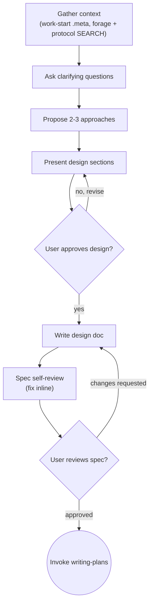

# Brainstorming Ideas Into Designs

Help turn ideas into fully formed designs and specs through natural
collaborative dialogue. Start by understanding context, then ask questions
one at a time to refine the idea, present the design, and get user approval.

<HARD-GATE>
Do NOT invoke any implementation skill, write any code, scaffold any project,
or take any implementation action until you have presented a design and the
user has approved it. This applies to EVERY project regardless of perceived
simplicity.
</HARD-GATE>

## Anti-Pattern: "This Is Too Simple To Need A Design"

Every project goes through this process. A todo list, a single-function
utility, a config change — all of them. "Simple" projects are where
unexamined assumptions cause the most wasted work. The design can be short
(a few sentences for truly simple projects), but you MUST present it and
get approval.

## Branch Context

If no feature branch exists, brainstorming results may not be tracked. Consider
running work-start first to establish a branch and issue context.

## Checklist

You MUST create a task for each of these items and complete them in order:

1. **Gather context** — check files, docs, recent commits. If work-start
   has run, read `$WORKSPACE/design/.meta` for `issue` and `covers` (the
   issue group). Run forage SEARCH and protocol SEARCH with keywords from
   the idea to surface relevant garden entries (gotchas, techniques, prior
   decisions) and project protocols (standing conventions, architectural
   constraints) before asking design questions.
2. **Ask clarifying questions** — one at a time, understand purpose,
   constraints, success criteria
3. **Propose 2-3 approaches** — with trade-offs and your recommendation
4. **Present design** — in sections scaled to complexity, get user approval
   after each section
5. **Write design doc** — save to `docs/specs/YYYY-MM-DD-<topic>-design.md`
   and commit
6. **Spec self-review** — quick inline check for placeholders,
   contradictions, ambiguity, scope (see below)
7. **User reviews written spec** — ask user to review before proceeding
8. **Transition to implementation** — invoke writing-plans

## Process Flow

**The terminal state is invoking writing-plans.** Do NOT invoke any other
implementation skill. The ONLY skill you invoke after brainstorming is
writing-plans.

## The Process

### Gathering Context

- Check the current project state (files, docs, recent commits)
- If work-start has run, read `$WORKSPACE/design/.meta` for the issue
  group context — the focal issue and what the branch covers
- Run forage SEARCH with keywords from the idea — surface relevant garden
  entries before the user starts answering design questions. A garden entry
  might document a gotcha, a technique, or a prior decision that shapes
  the design.
- Run protocol SEARCH with keywords from the idea — surface project rules
  and architectural constraints that may shape or constrain the design.
- Use ide-tooling for code navigation when exploring existing architecture
  (`ide_find_class`, `ide_find_symbol`, `ide_type_hierarchy`)

### Understanding the Idea

- Before asking detailed questions, assess scope: if the request describes
  multiple independent subsystems (e.g., "build a platform with chat, file
  storage, billing, and analytics"), flag this immediately. Don't spend
  questions refining details of a project that needs decomposition first.
- If the project is too large for a single spec, help the user decompose
  into sub-projects: what are the independent pieces, how do they relate,
  what order should they be built? Then brainstorm the first sub-project
  through the normal design flow. Each sub-project gets its own spec →
  plan → implementation cycle.
- Ask questions one at a time to refine the idea
- Prefer multiple choice questions when possible, but open-ended is fine
- Only one question per message — if a topic needs more exploration,
  break it into multiple questions
- Focus on understanding: purpose, constraints, success criteria

### Exploring Approaches

- Propose 2-3 different approaches with trade-offs
- Present options conversationally with your recommendation and reasoning
- Lead with your recommended option and explain why

### Presenting the Design

- Once you believe you understand what you're building, present the design
- Scale each section to its complexity: a few sentences if straightforward,
  up to 200-300 words if nuanced
- Ask after each section whether it looks right so far
- Cover: architecture, components, data flow, error handling, testing
- Be ready to go back and clarify if something doesn't make sense

### Design for Isolation and Clarity

- Break the system into smaller units that each have one clear purpose,
  communicate through well-defined interfaces, and can be understood and
  tested independently
- For each unit, you should be able to answer: what does it do, how do
  you use it, and what does it depend on?
- Can someone understand what a unit does without reading its internals?
  Can you change the internals without breaking consumers? If not, the
  boundaries need work.
- Smaller, well-bounded units are easier to work with — you reason better
  about code you can hold in context at once, and your edits are more
  reliable when files are focused.

### Working in Existing Codebases

- Explore the current structure before proposing changes. Follow existing
  patterns.
- Where existing code has problems that affect the work (e.g., a file
  that's grown too large, unclear boundaries, tangled responsibilities),
  include targeted improvements as part of the design.
- Don't propose unrelated refactoring. Stay focused on what serves the
  current goal.

## After the Design

### Documentation

- Write the validated design (spec) to `docs/specs/YYYY-MM-DD-<topic>-design.md`
  (user preferences for spec location override this default)
- Commit the design document to git

### Spec Self-Review

After writing the spec document, look at it with fresh eyes:

1. **Placeholder scan:** Any "TBD", "TODO", incomplete sections, or vague
   requirements? Fix them.
2. **Internal consistency:** Do any sections contradict each other? Does
   the architecture match the feature descriptions?
3. **Scope check:** Is this focused enough for a single implementation
   plan, or does it need decomposition?
4. **Ambiguity check:** Could any requirement be interpreted two different
   ways? If so, pick one and make it explicit.

Fix any issues inline. No need to re-review — just fix and move on.

Optionally, dispatch a spec reviewer subagent using the template at
[spec-document-reviewer-prompt.md](spec-document-reviewer-prompt.md)
for an independent review.

### User Review Gate

After the spec review loop passes, ask the user to review the written
spec before proceeding:

> "Spec written and committed to `<path>`. Please review it and let me
> know if you want to make any changes before we start writing out the
> implementation plan."

Wait for the user's response. If they request changes, make them and
re-run the spec review loop. Only proceed once the user approves.

### Implementation

Invoke writing-plans to create a detailed implementation plan. Do NOT
invoke any other skill. writing-plans is the next step.

## Key Principles

- **One question at a time** — don't overwhelm with multiple questions
- **Multiple choice preferred** — easier to answer than open-ended
- **YAGNI ruthlessly** — remove unnecessary features from all designs
- **Explore alternatives** — always propose 2-3 approaches before settling
- **Incremental validation** — present design, get approval before moving on
- **Be flexible** — go back and clarify when something doesn't make sense

## Visual Companion

A browser-based companion for showing mockups, diagrams, and visual
options during brainstorming. Available as a tool — not a mode.

**Offering (just-in-time):** Do NOT offer it upfront. Wait until a
question would genuinely be clearer shown than told — a real mockup,
layout, or diagram question, not merely a UI topic. The first time that
happens, offer it as its own message. If declined, continue text-only.

See [visual-companion.md](visual-companion.md) for the full guide.

## Skill Chaining

**Invoked by:**
- `using-superpowers` — process skill gate: "no implementation without
  approved design"

**Invokes:**
- `writing-plans` — the only valid terminal state

**Complements:**
- `forage` — SEARCH for relevant garden entries during context gathering
  (Step 1). Prior decisions, known gotchas, and technique docs shape the
  design before questions begin.
- `protocol` — SEARCH for relevant project protocols during context
  gathering (Step 1). Standing conventions and architectural constraints
  shape the design before questions begin.
- `ide-tooling` — Navigate tools for exploring existing architecture
  during context gathering.
- `work-start` — if work-start has run, `.meta` provides the issue group
  context. If not, brainstorming gathers all context itself.
- `design-review` — brainstorming creates the spec; design-review validates
  it (pre-review mode for approach, spec-review mode for detail)
