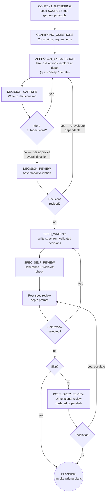

# Brainstorming Ideas Into Designs

Help turn ideas into fully formed designs and specs through natural
collaborative dialogue. Start by understanding context, then ask questions
one at a time to refine the idea, present the design, and get user approval.

<HARD-GATE>
Do NOT invoke any implementation skill, write any code, scaffold any project,
or take any implementation action until you have presented a design and the
user has approved it. This applies to EVERY project regardless of perceived
simplicity.
</HARD-GATE>

## Anti-Pattern: "This Is Too Simple To Need A Design"

Every project goes through this process. A todo list, a single-function
utility, a config change — all of them. "Simple" projects are where
unexamined assumptions cause the most wasted work. The design can be short
(a few sentences for truly simple projects), but you MUST present it and
get approval.

## Branch Context

**Before brainstorming on main**, run `work start` to create a feature
branch and `.plan`. Brainstorming on main without a branch means specs
and decisions land in untracked workspace state, and the downstream
Build flow (`writing-plans → executing-plans`) will fail at the `.plan`
guard in `executing-plans` Step 0. If you proceed on main, you will
need to run `work start` before execution can begin.

## Pipeline State

Brainstorming manages a pipeline state file at
`$WORKSPACE/specs/<branch>/pipeline.state`. This file tracks progress
through the design pipeline and enables crash recovery and external
tool observation (e.g., drafthouse).

Write the state file at each transition:

```
format_version: 1
state: <STATE_NAME>
entered: <ISO-8601 timestamp>
decision_count: <N>
dimensions_completed: 0
dimensions_total: 0
ordered: false
dimensions_done:
current_dimension:
workspace_structure:
workspace_coherence:
workspace_robustness:
workspace_crosscutting:
workspace_decision:
```

States: `CONTEXT_GATHERING`, `CLARIFYING_QUESTIONS`, `APPROACH_EXPLORATION`,
`DECISION_CAPTURE`, `DECISION_REVIEW`, `DECISION_REVISION`, `SPEC_WRITING`,
`SPEC_SELF_REVIEW`, `POST_SPEC_REVIEW`, `PLANNING`.

Overwrite the file at each transition — git history preserves the trail.
Update `decision_count` each time a decision is captured.

## Commit Discipline

**Commit after every write.** All workspace artifacts — pipeline.state,
decisions.md, spec docs, exploration docs — must be committed immediately
after writing. Use WIP-style messages; semantic squash cleans them up later.

```bash
git -C "$WORKSPACE" add specs/<branch>/
git -C "$WORKSPACE" commit -m "wip(design): <what changed> Refs #<N>"
```

This is not optional. Uncommitted files are lost on session crash and cause
dirty-tree failures in work-end. The commit is the save.

## Checklist

You MUST create a task for each of these items and complete them in order:

1. **Gather context** — check files, docs, recent commits. If work-start
   has run, read `$WORKSPACE/.plan`'s `## State` for `covers` (the
   issue group). Run forage SEARCH and protocol SEARCH with keywords from
   the idea to surface relevant garden entries (gotchas, techniques, prior
   decisions) and project protocols (standing conventions, architectural
   constraints) before asking design questions. Reference SOURCES.md for
   platform coherence ("does this already exist?").
2. **Ask clarifying questions** — one at a time, understand purpose,
   constraints, success criteria
3. **Propose 2-3 approaches** — with trade-offs and your recommendation.
   Explore at appropriate depth (quick pick, deep analysis, or
   multi-agent debate — see Approach Exploration Depth below).
4. **Capture decision** — write each choice to `decisions.md` (see
   Decision Capture below). Loop steps 3-4 for sub-decisions.
5. **Decision review** — after all decisions captured, invoke
   decision-review for adversarial validation (see Decision Review Gate)
6. **Present design** — in sections scaled to complexity, get user approval
   after each section
7. **Write design doc** — save to `$WORKSPACE/specs/<branch-name>/YYYY-MM-DD-<topic>-design.md`
   and commit (if no workspace, fall back to `docs/specs/` in the project)
8. **Spec self-review** — check for placeholders, contradictions, ambiguity,
   scope, SOURCES.md coherence, and trade-off verification (see below)
9. **User reviews written spec** — ask user to review before proceeding
10. **Transition to implementation** — invoke writing-plans

## Process Flow


```mermaid
flowchart TD
    CONTEXT["CONTEXT_GATHERING\nLoad SOURCES.md, garden, protocols"]
    QUESTIONS["CLARIFYING_QUESTIONS\nConstraints, requirements"]
    EXPLORE["APPROACH_EXPLORATION\nPropose options, explore at depth\n(quick / deep / debate)"]
    CAPTURE["DECISION_CAPTURE\nWrite to decisions.md"]
    MORE{"More\nsub-decisions?"}
    DREVIEW["DECISION_REVIEW\nAdversarial validation"]
    REVISED{"Decisions\nrevised?"}
    WRITE["SPEC_WRITING\nWrite spec from validated decisions"]
    SELFREVIEW["SPEC_SELF_REVIEW\nCoherence + trade-off check"]
    POSTDEGREE["Post-spec review\ndepth prompt"]
    SELFREV{"Self-review\nselected?"}
    SKIP{"Skip?"}
    POSTREVIEW["POST_SPEC_REVIEW\nDimensional review\n(ordered or parallel)"]
    ESCALATE{"Escalation?"}
    PLANS(("PLANNING\nInvoke writing-plans"))

    CONTEXT --> QUESTIONS
    QUESTIONS --> EXPLORE
    EXPLORE --> CAPTURE
    CAPTURE --> MORE
    MORE -->|"yes"| EXPLORE
    MORE -->|"no — user approves\noverall direction"| DREVIEW
    DREVIEW --> REVISED
    REVISED -->|"yes — re-evaluate\ndependents"| EXPLORE
    REVISED -->|"no"| WRITE
    WRITE --> SELFREVIEW
    SELFREVIEW --> POSTDEGREE
    POSTDEGREE --> SELFREV
    SELFREV -->|"yes"| WRITE
    SELFREV -->|"no"| SKIP
    SKIP -->|"yes"| PLANS
    SKIP -->|"no"| POSTREVIEW
    POSTREVIEW --> ESCALATE
    ESCALATE -->|"yes, escalate"| POSTDEGREE
    ESCALATE -->|"no"| PLANS
```

**The terminal state is invoking writing-plans.** Do NOT invoke any other
implementation skill. The ONLY skill you invoke after brainstorming is
writing-plans.

## The Process

### Gathering Context

- Check the current project state (files, docs, recent commits)
- If work-start has run, read `$WORKSPACE/.plan`'s `## State` for the issue
  group context — the focal issue and what the branch covers
- Run forage SEARCH with keywords from the idea — surface relevant garden
  entries before the user starts answering design questions. A garden entry
  might document a gotcha, a technique, or a prior decision that shapes
  the design. After the user selects which entries are relevant, **record
  provenance** — call `gardenRecordProvenance` with the selected GE-IDs:
  ```
  gardenRecordProvenance(
      issueRepo=<from .plan issue-repo>,
      issueNumber=<from .plan covers>,
      specName="",
      geIds=<pipe-separated selected GE-IDs>,
      recordedBy="brainstorming"
  )
  ```
  If `gardenRecordProvenance` is unavailable (engine not running), warn
  once and continue — provenance recording is never a gate on work.
- **Record retrieval feedback** — the selection is the feedback signal.
  Selected entries are RELEVANT or HIGHLY_RELEVANT; unselected entries
  from the search results are NOT_RELEVANT or PARTIALLY_RELEVANT.
  If an entry's advice no longer applies for the project's current stack
  versions, use OUTDATED with the stack — this is stronger than
  NOT_RELEVANT and flags the entry for revision during harvest:
  ```
  gardenFeedback(geIds: "GE-...|GE-...", outcome: "HIGHLY_RELEVANT",
      issueRepo: "<from .plan>", issueNumber: <from .plan>)
  gardenFeedback(geIds: "GE-...|GE-...", outcome: "NOT_RELEVANT",
      issueRepo: "<from .plan>", issueNumber: <from .plan>)
  gardenFeedback(geIds: "GE-...", outcome: "OUTDATED",
      stack: "quarkus:3.36.1|jdk:26",
      issueRepo: "<from .plan>", issueNumber: <from .plan>)
  ```
  Always pass `issueRepo` and `issueNumber` from `.plan` when available.
  Get stack versions from pom.xml, package.json, or CLAUDE.md.
  Non-blocking — if unavailable, warn once and continue.
- Run protocol SEARCH with keywords from the idea — surface project rules
  and architectural constraints that may shape or constrain the design.
- **SOURCES.md coherence check:** If SOURCES.md exists (inlined via
  CLAUDE.md or at the project root), reference it before proposing
  approaches. Two questions: "Does the platform already have this?"
  and "Where does this belong?" Check capability docs, boundary rules,
  and architecture docs listed in SOURCES.md.
- Use ide-tooling for code navigation when exploring existing architecture
  (`ide_find_class`, `ide_find_symbol`, `ide_type_hierarchy`)

### Understanding the Idea

- Before asking detailed questions, assess scope: if the request describes
  multiple independent subsystems (e.g., "build a platform with chat, file
  storage, billing, and analytics"), flag this immediately. Don't spend
  questions refining details of a project that needs decomposition first.
- If the project is too large for a single spec, help the user decompose
  into sub-projects: what are the independent pieces, how do they relate,
  what order should they be built? Then brainstorm the first sub-project
  through the normal design flow. Each sub-project gets its own spec →
  plan → implementation cycle.
- Ask questions one at a time to refine the idea
- Prefer multiple choice questions when possible, but open-ended is fine
- Only one question per message — if a topic needs more exploration,
  break it into multiple questions
- Focus on understanding: purpose, constraints, success criteria

### Exploring Approaches

- Propose 2-3 different approaches with trade-offs
- Present options conversationally with your recommendation and reasoning
- Lead with your recommended option and explain why
- Assess architectural impact and offer exploration at the appropriate
  depth (see Approach Exploration Depth below)

### Approach Exploration Depth

When presenting 2-3 approaches, assess architectural impact and offer
the appropriate exploration depth. The user can always escalate ("let's
debate this") or de-escalate ("just go with A") regardless of the
recommendation.

**Level 1 — Quick pick:** Low impact (config, naming, wiring). Present
options with recommendation. If user selects immediately, capture with
`Exploration: quick`.

**Level 2 — Deep analysis:** Moderate impact (new module, API surface).
When user is uncertain, perform structured analysis of each approach:

1. **Steelman** each option — the strongest possible case
2. **Devil's advocate** each option — why it might fail, what it can't handle
3. **Internet search** — prior art, current best practices, industry patterns
4. **First-principles analysis** — improve on the proposals, potentially
   surface new options not originally presented

Present a strengthened recommendation with full reasoning. Capture with
`Exploration: deep-analysis`. Write analysis to
`$WORKSPACE/specs/<branch>/explorations/D<N>-exploration.md`.

**Level 3 — Multi-agent debate:** High impact (novel architecture,
cross-repo boundary, data model). When user signals high stakes or
requests debate:

1. Spawn N parallel agents (one per approach). Each agent's brief:
   "Make the strongest case for approach X. Explain why it is better
   than approaches Y and Z. Address weaknesses honestly but argue for
   your position. Search the internet for supporting evidence and
   prior art."
2. Collect all position papers.
3. Spawn a mediator agent: "Read these N position papers. Determine
   which approach wins on merit. Identify genuine strengths from the
   losing approaches that should be incorporated. Propose a hybrid if
   neither advocate's pure position is optimal."
4. Present the mediator's synthesis to the user.
5. User decides — or requests another round of debate on specific points.

**Subsequent debate rounds:** If the user requests another round:
- Specify which points to debate further (free text)
- Previous position papers are preserved
- Only the mediator is re-spawned with updated instructions (advocates
  are NOT re-spawned — their positions are settled)
- Max 3 debate rounds total

Capture with `Exploration: multi-agent-debate`. Write artifacts to
`$WORKSPACE/specs/<branch>/explorations/D<N>-debate/`:
- `advocate-A.md`, `advocate-B.md`, `advocate-C.md` (position papers)
- `mediator-synthesis-1.md` (per round)

**Failure handling:**
- Advocate failure with ≥2 surviving: proceed with survivors
- Only 1 advocate succeeds: fall back to deep analysis (Level 2)
- Mediator failure: present raw position papers to user

**Proactive recommendation:** Don't wait for user to ask. Recommend
deep analysis for moderate-impact decisions, debate for high-impact.

### Decision Capture

After the user selects an approach (or any sub-decision where 2+ options
were presented), write the decision to
`$WORKSPACE/specs/<branch>/decisions.md`:

```markdown
## D<N>: <short title>

**Choice:** <what was selected>
**Alternatives:**
- <option B> — <one-line trade-off>
- <option C> — <one-line trade-off>
**Rationale:** <why this choice>
**Trade-offs:** <what we're giving up>
**Sources:** <code files, garden entries, docs, or URLs that informed this decision>
**Exploration:** <quick | deep-analysis | multi-agent-debate>
**Status:** captured
```

If a later decision depends on an earlier one, add:
`**Depends on:** D<N> (<short description>)`

Write each decision incrementally — append to the file as decisions are
made. Update pipeline.state with incremented `decision_count` and
transition to `DECISION_CAPTURE` state.

**What is NOT a decision:** Constraints ("Who is the primary user?" →
"Internal developers"), requirements ("Do you need real-time?" → "Yes"),
and clarifications that narrow scope without choosing between alternatives.

After writing the decision, check if more sub-decisions are needed in
the design:
- Yes → transition back to `APPROACH_EXPLORATION` for the next sub-decision
- No (user approves overall design direction) → transition to
  `DECISION_REVIEW` (see Decision Review Gate below)

### Presenting the Design

- Once you believe you understand what you're building, present the design
- Scale each section to its complexity: a few sentences if straightforward,
  up to 200-300 words if nuanced
- Ask after each section whether it looks right so far
- Cover: architecture, components, data flow, error handling, testing
- Be ready to go back and clarify if something doesn't make sense

### Design for Isolation and Clarity

- Break the system into smaller units that each have one clear purpose,
  communicate through well-defined interfaces, and can be understood and
  tested independently
- For each unit, you should be able to answer: what does it do, how do
  you use it, and what does it depend on?
- Can someone understand what a unit does without reading its internals?
  Can you change the internals without breaking consumers? If not, the
  boundaries need work.
- Smaller, well-bounded units are easier to work with — you reason better
  about code you can hold in context at once, and your edits are more
  reliable when files are focused.

### Working in Existing Codebases

- Explore the current structure before proposing changes. Follow existing
  patterns.
- Where existing code has problems that affect the work (e.g., a file
  that's grown too large, unclear boundaries, tangled responsibilities),
  include targeted improvements as part of the design.
- Don't propose unrelated refactoring. Stay focused on what serves the
  current goal.

### Decision Review Gate

After all decisions are captured and the user approves the overall design
direction, present the decision review depth prompt.

Count exploration depths from decisions.md:
- M decisions with `Exploration: quick`
- K decisions with `Exploration: deep-analysis`
- J decisions with `Exploration: multi-agent-debate`

Recommendation: many quick picks → Standard or Adversarial. All
deep/debate → Light or Skip.

**Always show all four options in ascending cost order.** Mark the
recommendation with "(Recommended)" in its natural position — never
move it to the top, never omit options.

```python
AskUserQuestion(questions=[{
    "question": "N decisions captured (M quick, K deep, J debate). Review depth?",
    "header": "Decision review",
    "options": [
        {"label": "Skip", "description": "Proceed to spec writing"},
        {"label": "Light", "description": "~2 min — single pass"},
        {"label": "Standard", "description": "~5 min — 2-3 rounds"},
        {"label": "Adversarial", "description": "~12 min — 4-6 rounds"},
    ],
    "multiSelect": false,
}])
# Append "(Recommended)" to the label of the recommended option
```

If Skip: transition to `SPEC_WRITING`, proceed to "After the Design."

If review selected: launch decision review:
```bash
python3 ~/.claude/skills/design-review/review.py \
  --spec $WORKSPACE/specs/<branch>/decisions.md \
  --title <branch>-decision \
  --type decision --degree <selected> \
  --stage <maturity_stage> \
  --source-dirs <project-dirs>
```

Run with `run_in_background: true`. Set up watchdog cron to monitor.

When review completes, read pipeline.state:
- If `DECISION_REVISION`: enter Revision Cycles
- If `SPEC_WRITING`: proceed to "After the Design"

### Revision Cycles

When decision-review revises decisions:

1. Read decisions.md — find entries with `Status: revised`
2. For each revised decision, find direct dependents (`Depends on:`
   pointing to it)
3. Re-evaluate each dependent: present the dependency change to the user,
   ask if the dependent decision still holds
4. If dependents change, capture updates (loop back to `DECISION_CAPTURE`)
5. Max 2 revision cycles. If reached with unprocessed dependents,
   escalate to user with explanation of whether this is:
   - **Chain propagation** (D1 → D3 → D5, linear chain longer than 2
     cycles) — user can approve another cycle
   - **Circular tension** (D2 → D5 → D2, dependency cycle) — requires
     human judgment to break the loop
6. Null cycles (no substantive changes) don't count toward the max

## After the Design

### Documentation

- Write the validated design (spec) to `$WORKSPACE/specs/<branch-name>/YYYY-MM-DD-<topic>-design.md`
  (if no workspace or branch, fall back to `docs/specs/` in the project)
- **Record provenance with spec name:** If garden entries were selected
  during context gathering, re-record provenance with the spec filename:
  ```
  gardenRecordProvenance(
      issueRepo=<from .plan>,
      issueNumber=<from .plan>,
      specName=<spec filename>,
      geIds=<pipe-separated selected GE-IDs>,
      recordedBy="brainstorming"
  )
  ```
  This updates the existing provenance records with the spec name via
  UPSERT — no duplicates are created.
- **Include a References section** at the end of every spec document:
  ```markdown
  ## References

  - [source-file:line or URL] — what it informed
  - [GE-ID] — garden entry title
  - [ADR-NNNN] — decision title
  - [protocol] — protocol title
  ```
  List every source consulted during design: code files read, garden
  entries surfaced, ADRs referenced, protocols checked, external docs,
  GitHub issues. The reader should be able to trace every design
  decision back to its source. Omit only trivially obvious references
  (e.g. the issue itself).
- Commit the design document to git

### Spec Self-Review

After writing the spec document, look at it with fresh eyes:

1. **Placeholder scan:** Any "TBD", "TODO", incomplete sections, or vague
   requirements? Fix them.
2. **Internal consistency:** Do any sections contradict each other? Does
   the architecture match the feature descriptions?
3. **Scope check:** Is this focused enough for a single implementation
   plan, or does it need decomposition?
4. **Ambiguity check:** Could any requirement be interpreted two different
   ways? If so, pick one and make it explicit.
5. **SOURCES.md coherence check:** Re-read SOURCES.md. Does the spec
   duplicate existing capability? Violate boundary rules? Fit the
   module hierarchy?
6. **Trade-off verification:** For each decision in decisions.md with
   non-empty Trade-offs, verify the spec acknowledges the limitation.
   For multi-agent-debate decisions, verify the spec references the
   strongest counter-argument from the losing positions. Post-spec
   reviewers do NOT receive decisions.md — the spec must stand alone.

Fix any issues inline. No need to re-review — just fix and move on.

Optionally, dispatch a spec reviewer subagent using the template at
[spec-document-reviewer-prompt.md](spec-document-reviewer-prompt.md)
for an independent review.

### Review Depth Prompt → writing-plans (MANDATORY gate)

**You MUST complete this step before invoking writing-plans. There is no
path from spec approval to writing-plans that bypasses this prompt.**

After the spec is written and committed, go straight to the review
prompt. Do NOT ask "let me know if you want changes" as a separate
step — "Review it yourself" is an option in the prompt itself.

1. Analyze the spec for complexity signals and present the full
   recommendation with reasoning as text (see `design-review/review-tiers.md`
   for recommendation signals).
2. Use a single `AskUserQuestion` for degree and ordering.

**Always show all options in ascending cost order.** Mark the
recommendation with "(Recommended)" in its natural position. Never
omit options — the user decides.

```python
AskUserQuestion(questions=[{
    "question": "Spec committed to <path>. Post-spec review depth?",
    "header": "Review",
    "options": [
        {"label": "Skip", "description": "No review needed"},
        {"label": "Light", "description": "~2 min — single pass, self-review available via Other"},
        {"label": "Standard (Recommended)", "description": "~5 min — 2-3 rounds"},
        {"label": "Adversarial", "description": "~12 min — 4-6 rounds"},
    ],
    "multiSelect": false,
}])
```

If the user selects Other and asks for self-review: re-read the spec,
propose changes, apply on confirmation, then re-present the depth prompt.

When cross-module complexity is detected, note "ordered variant available
via Other" in the Standard/Adversarial descriptions — do NOT add extra
options (AskUserQuestion hard limit: 4 options max).

3. If "Review it yourself": re-read the spec, propose changes, apply
   on confirmation, then re-present this prompt. Loop until the user
   selects a review depth or Skip.
4. If not Skip: invoke `design-review` with `--degree` flag only.
   design-review handles multi-dimension orchestration and cross-cutting
   automatically.

**After review completes (or Skip is selected):** invoke writing-plans
to create the implementation plan. writing-plans is the only valid
next step from here.

## Key Principles

- **One question at a time** — don't overwhelm with multiple questions
- **Multiple choice preferred** — easier to answer than open-ended
- **YAGNI ruthlessly** — remove unnecessary features from all designs
- **Explore alternatives** — always propose 2-3 approaches before settling
- **Incremental validation** — present design, get approval before moving on
- **Be flexible** — go back and clarify when something doesn't make sense

## Visual Companion

A browser-based companion for showing mockups, diagrams, and visual
options during brainstorming. Available as a tool — not a mode.

**Offering (just-in-time):** Do NOT offer it upfront. Wait until a
question would genuinely be clearer shown than told — a real mockup,
layout, or diagram question, not merely a UI topic. The first time that
happens, offer it as its own message. If declined, continue text-only.

See [visual-companion.md](visual-companion.md) for the full guide.

## Skill Chaining

**Invoked by:**
- `using-superpowers` — process skill gate: "no implementation without
  approved design"

**Invokes:**
- `design-review` — conditionally, when review depth prompt selects a review (not Skip)
- `writing-plans` — terminal state after review completes (or Skip)

**Complements:**
- `forage` — SEARCH for relevant garden entries during context gathering
  (Step 1). Prior decisions, known gotchas, and technique docs shape the
  design before questions begin.
- `protocol` — SEARCH for relevant project protocols during context
  gathering (Step 1). Standing conventions and architectural constraints
  shape the design before questions begin.
- `ide-tooling` — Navigate tools for exploring existing architecture
  during context gathering.
- `work-start` — if work-start has run, `.plan`'s `## State` provides the issue group
  context. If not, brainstorming gathers all context itself.
- `design-review` — brainstorming creates the spec; design-review validates
  it (pre-review mode for approach, spec-review mode for detail)
