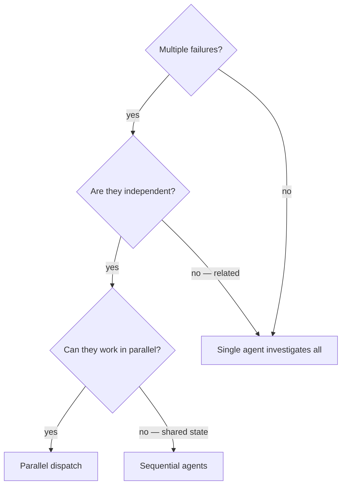

# Dispatching Parallel Agents

## Overview

When you have multiple unrelated failures — different test files, different
subsystems, different bugs — investigating them sequentially wastes time.
Each investigation is independent and can happen in parallel.

**Core principle:** Dispatch one agent per independent problem domain. Let them work concurrently.

## When to Use



**Use when:**
- 2+ independent problems exist (different subsystems, different root causes)
- Each problem can be understood without context from the others
- No shared state between investigations
- Agents won't interfere with each other (different files, different resources)

**Don't use when:**
- Failures are related (fix one might fix others) — investigate together first
- Need to understand full system state before acting
- Agents would interfere (editing same files, using same resources)
- Exploratory debugging — you don't know what's broken yet (use systematic-debugging first)

## The Pattern

### 1. Identify Independent Domains

Group failures by what's broken:
- File A tests: Tool approval flow
- File B tests: Batch completion behavior
- File C tests: Abort functionality

Each domain is independent — fixing tool approval doesn't affect abort tests.

### 2. Create Focused Agent Tasks

Each agent gets:
- **Specific scope:** One test file or subsystem
- **Clear goal:** Make these tests pass
- **Constraints:** Don't change other code
- **Expected output:** Summary of what you found and fixed
- **Discipline:** Follow test-driven-development for fixes. Use ide-tooling for code navigation and structural editing.

### 3. Dispatch in Parallel

Issue all agent dispatches in the same response — they run in parallel:

```text
Agent (general-purpose): "Fix agent-tool-abort.test.ts failures"
Agent (general-purpose): "Fix batch-completion-behavior.test.ts failures"
Agent (general-purpose): "Fix tool-approval-race-conditions.test.ts failures"
# All three run concurrently.
```

Multiple dispatch calls in one response = parallel execution. One per response = sequential.

### 4. Review and Integrate

When agents return:
- Read each summary
- Verify fixes don't conflict
- Run full test suite
- Integrate all changes

## Agent Prompt Structure

Good agent prompts are:
1. **Focused** — one clear problem domain
2. **Self-contained** — all context needed to understand the problem
3. **Specific about output** — what should the agent return?
4. **Discipline-aware** — reference TDD and ide-tooling

```markdown
Fix the 3 failing tests in src/agents/agent-tool-abort.test.ts:

1. "should abort tool with partial output capture" - expects 'interrupted at' in message
2. "should handle mixed completed and aborted tools" - fast tool aborted instead of completed
3. "should properly track pendingToolCount" - expects 3 results but gets 0

These are timing/race condition issues. Your task:

1. Read the test file and understand what each test verifies
2. Identify root cause — timing issues or actual bugs?
3. Fix by:
   - Replacing arbitrary timeouts with event-based waiting
   - Fixing bugs in abort implementation if found
   - Adjusting test expectations if testing changed behavior
4. Follow TDD: write a failing test if adding new behavior, verify red-green cycle
5. Use ide-tooling for code navigation (ide_call_hierarchy, ide_find_references)
   and structural editing (ide_replace_member for fixes)

Do NOT just increase timeouts — find the real issue.

Return: Summary of root cause and changes made.
```

## Common Mistakes

| Mistake | Fix |
|---------|-----|
| Too broad: "Fix all the tests" | Specific: "Fix agent-tool-abort.test.ts" |
| No context: "Fix the race condition" | Context: paste error messages and test names |
| No constraints: agent might refactor everything | Constraints: "Do NOT change production code" or "Fix tests only" |
| Vague output: "Fix it" | Specific: "Return summary of root cause and changes" |
| No discipline: agent guesses at fixes | Discipline: "Follow TDD, use ide-tooling" |

## Verification

After agents return:
1. **Review each summary** — understand what changed
2. **Check for conflicts** — did agents edit the same code?
3. **Run full suite** — verify all fixes work together
4. **Spot check** — agents can make systematic errors

## Real Example

**Scenario:** 6 test failures across 3 files after major refactoring

**Failures:**
- agent-tool-abort.test.ts: 3 failures (timing issues)
- batch-completion-behavior.test.ts: 2 failures (tools not executing)
- tool-approval-race-conditions.test.ts: 1 failure (execution count = 0)

**Decision:** Independent domains — abort logic separate from batch completion separate from race conditions

**Dispatch:** 3 agents, one per file, all in the same response

**Results:**
- Agent 1: Replaced timeouts with event-based waiting
- Agent 2: Fixed event structure bug (threadId in wrong place)
- Agent 3: Added wait for async tool execution to complete

**Integration:** All fixes independent, no conflicts, full suite green

## Skill Chaining

**The debugging toolkit:** Three skills covering the debugging spectrum:
- `systematic-debugging` — single root cause investigation
- `dispatching-parallel-agents` (this skill) — multiple independent root causes, investigated concurrently
- `fix-ci` — CI-specific failures (local reproduction, CI-specific patterns)

**Invoked by:**
- `systematic-debugging` — Phase 1 Step 6: when investigation reveals 2+ independent root causes
- `fix-ci` — multiple CI failures across subsystems
- `subagent-driven-development` — failure recovery during execution (multiple tasks failing independently)

**Complements:**
- `test-driven-development` — each dispatched agent follows TDD for its fixes
- `verification-before-completion` — after integration, verify the whole before claiming done
- `ide-tooling` — dispatched agents use Navigate tools for investigation and Edit tools for fixes
