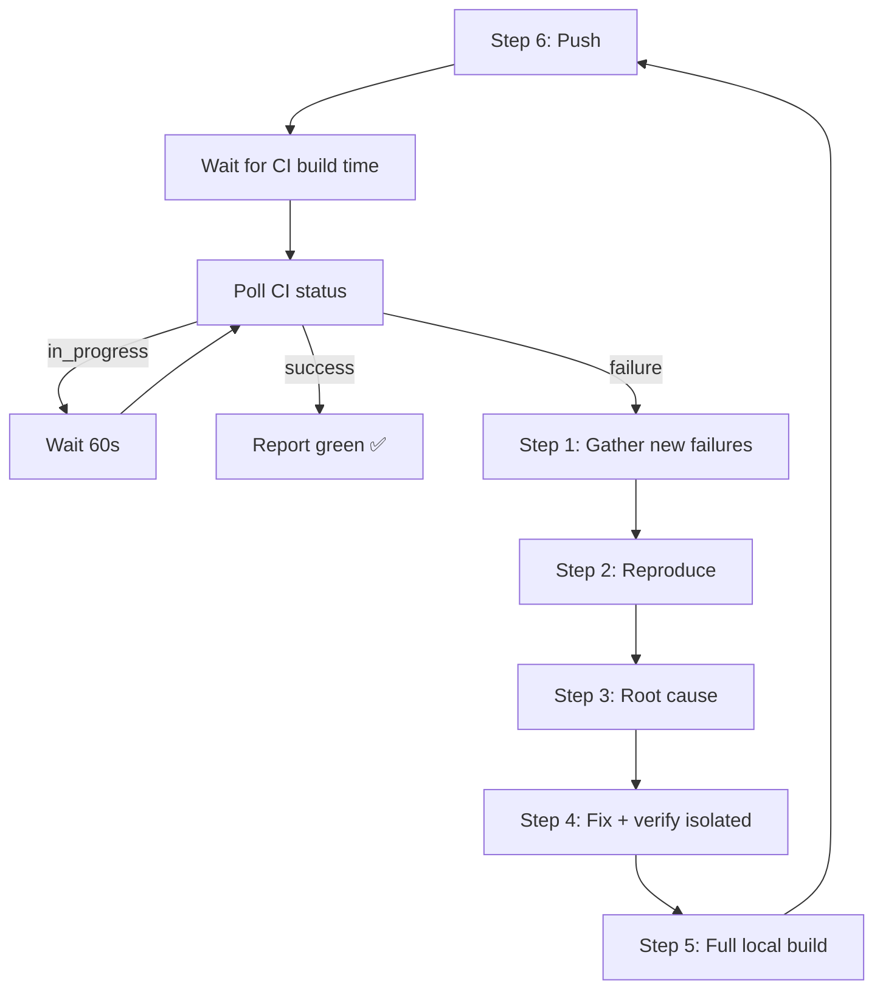

# Fix CI

Get CI green. Every failure — whether introduced this session, last week, or
six months ago — gets reproduced, diagnosed, and fixed. The goal is a green
build, not blame attribution. Pre-existing failures are not someone else's
problem; they are failures that block shipping.

**Anti-pattern this replaces:** fix one symptom → push → wait 5 min → check CI
→ find next failure → repeat. This uses CI as a test runner, creates long wait
cycles, and fixes symptoms instead of root causes. Also replaces: "those tests were already failing" and "this is a CI/workflow
issue, not a code fix" — if it's preventing green, it's in scope. Workflow
files, GitHub Actions configs, test infrastructure, flaky tests, missing
dependencies — all of it.

---

## Step 1 — Gather failures

Get the list of failing tests from CI.

```bash
gh run list --repo <OWNER_REPO> --limit 1 --json databaseId --jq '.[0].databaseId'
gh run view <ID> --repo <OWNER_REPO> --log-failed 2>/dev/null | grep "<<< FAILURE\|<<< ERROR"
```

Record every failing test class and its error message. This is the full scope —
don't stop at the first one.

---

## Step 2 — Reproduce locally (isolated)

For each failing test, reproduce the failure locally by running **only that test**.
Not the full suite — isolated, fast.

> **Maven command:** Use the project's Maven command (per CLAUDE.md — typically
> `/opt/homebrew/bin/mvn` or `./mvnw`).

```bash
# Example for Maven/Quarkus (substitute the project's Maven command)
mvn test -f <module>/pom.xml -Dtest=FailingTestClass

# Example for npm
npm test -- --testPathPattern=failing-test

# Example for Python/pytest
python3 -m pytest tests/path/test_file.py::test_name -v
```

**If the test passes locally in isolation:** the failure is test-ordering
contamination. Run the full module suite to reproduce:
```bash
mvn test -f <module>/pom.xml
```

**If the test needs infrastructure** (Docker, database, external service):
check if the CI environment provides it and the local environment doesn't.
The test should skip gracefully when infrastructure is absent — if it doesn't,
that's part of the fix.

### Remote machine option

If the user has configured a remote test machine (SSH access, same repo checked out),
run the isolated test there instead:

```bash
ssh <remote> "cd <project-path> && <test-command> -Dtest=FailingTestClass"
```

Only use the remote machine for isolated test runs (Steps 2 and 4), not the
full build (Step 5). The remote option is for cases where the local machine
lacks infrastructure (Docker, specific JDK, native image toolchain) that CI has.

---

## Step 3 — Root cause analysis

For each failure, diagnose the **root cause**, not the symptom.

**The question:** what changed, and what else does it affect?

- If a new column was added: which modules have entities with that column?
  Check ALL of them, not just the one that failed.
- If a config property changed: which modules have their own copy of that config?
  Check ALL of them.
- If a CDI bean changed: which modules depend on it? Trace the dependency tree.
- If a test infrastructure change was made: which modules share the same test
  infrastructure pattern? Fix them all.

**Root cause checklist:**
1. What is the immediate error? (symptom)
2. What code change caused it? (trigger)
3. What is the architectural pattern that was violated? (root cause)
4. Where else in the project does the same pattern exist? (blast radius)
5. Fix all instances, not just the one that failed.

**Exhaustive means exhaustive.** Use IDE search (`ide_search_text`,
`ide_find_references`) first, then `grep`/`find` as fallback, to locate
every instance of the pattern. A tenancyId fix that catches runtime but misses
examples, queues-examples, queues-dashboard, ai, and flow-examples is a symptom
fix. The root cause is "every module that persists entities needs tenancyId" —
find them all.

---

## Step 4 — Fix and verify (isolated loop)

For each failing test:

1. Apply the fix
2. Run **only that test** locally (or on the remote machine)
3. Confirm it passes
4. Move to the next failing test

Do not run the full suite yet. Isolated runs are fast — seconds, not minutes.

```
Loop:
  pick next failing test
  → apply fix
  → run isolated test
  → green? → next test
  → red?  → back to Step 3, dig deeper
```

---

## Step 5 — Full local build

Only after ALL isolated tests pass.

Run the complete test suite for all modules. This catches:
- Cross-module contamination
- Test ordering issues
- Transitive dependency breaks

> **Maven command:** Use the project's Maven command (per CLAUDE.md — typically
> `/opt/homebrew/bin/mvn` or `./mvnw`).

```bash
# Maven multi-module (substitute the project's Maven command)
mvn test -pl module1,module2,module3,...

# Or the project's full build script
scripts/check-build
```

**If new failures appear:** go back to Step 2 for those failures.
Do not push until the full local build is green.

---

## Step 6 — Push

One push. One CI run.

```bash
git push
```

---

## Step 7 — Poll CI until green (or new failures)

After pushing, poll CI in a loop until it completes. Do NOT return to
the user and wait — stay in the loop.

**Initial wait:** check CLAUDE.md for `ci-build-time-minutes` under
`## Build and Test`. Default: 5 minutes. Wait that long before the
first poll, then poll every 60 seconds.

```bash
# Wait for initial build time
sleep <ci-build-time-seconds or 300>
```

Then poll in a loop:

```bash
gh run list --repo <OWNER_REPO> --limit 1 \
  --json status,conclusion,headSha \
  --jq '.[0] | "\(.status) | \(.conclusion // "—") | \(.headSha[:7])"'
```

| Result | Action |
|--------|--------|
| `completed + success` | Done. Report green. Exit the skill. |
| `completed + failure` | New failures. Go back to Step 1 with the new failure list. Full cycle repeats. |
| `in_progress` or `queued` | Wait 60 seconds, poll again. |

**This is a loop.** Do not exit the skill until CI is green or the user
interrupts. The full cycle is: gather → reproduce → root-cause → fix →
verify locally → push → poll CI → if red, repeat from Step 1.



---

## Prerequisites

**This skill builds on `ide-tooling`**. Use IntelliJ MCP tools for code
navigation and reference search when investigating failures.

## Skill Chaining

**Invoked by:** User saying "fix CI", "CI is red", "is CI green?" after
a push, or when a pre-push hook or CI check fails.

**Invokes:** Nothing — standalone diagnostic and fix workflow.

**Complements:** `java-dev`, `ts-dev`, `python-dev` for the actual code
fixes; `git-commit` for committing the fixes;
`verification-before-completion` for the final green check.

**The debugging toolkit:** Three skills covering the debugging spectrum:
- `systematic-debugging` — single root cause investigation
- `dispatching-parallel-agents` — multiple independent root causes,
  investigated concurrently
- `fix-ci` (this skill) — CI-specific failures (local reproduction,
  CI-specific patterns)
