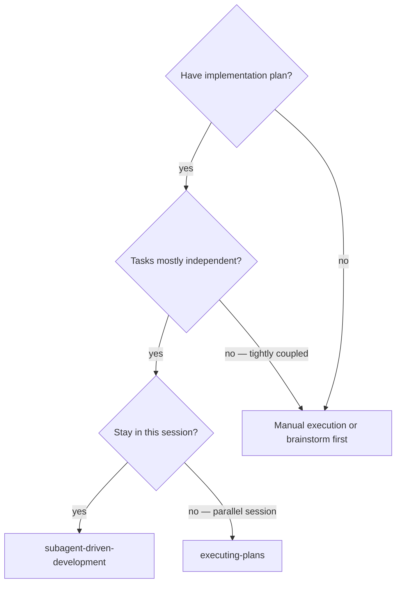
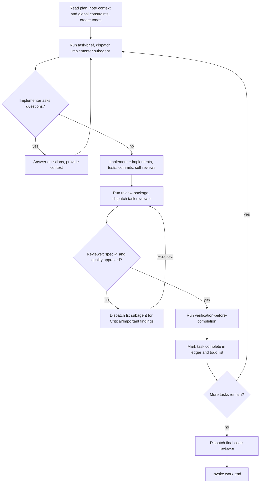

# Subagent-Driven Development

Execute a plan by dispatching a fresh implementer subagent per task, a
task review (spec compliance + code quality) after each, verification
before marking done, and a broad whole-branch review at the end.

**Why subagents:** You delegate tasks to specialized agents with isolated
context. By precisely crafting their instructions and context, you ensure
they stay focused and succeed at their task. They should never inherit
your session's context or history — you construct exactly what they need.
This also preserves your own context for coordination work.

**Core principle:** Fresh subagent per task + task review (spec + quality)
+ verification + broad final review = high quality, fast iteration

**Narration:** between tool calls, narrate at most one short line — the
ledger and the tool results carry the record.

**Continuous execution:** Do not pause to check in with your human partner
between tasks. Execute all tasks from the plan without stopping. The only
reasons to stop are: BLOCKED status you cannot resolve, ambiguity that
genuinely prevents progress, or all tasks complete. "Should I continue?"
prompts and progress summaries waste their time — they asked you to
execute the plan, so execute it.

## When to Use

**vs. executing-plans:**
- Same session (no context switch)
- Fresh subagent per task (no context pollution)
- Review after each task (spec compliance + code quality), broad review
  at the end
- Faster iteration (no human-in-loop between tasks)

## The Process

## Pre-Flight Plan Review

Before dispatching Task 1, scan the plan once for conflicts:

- tasks that contradict each other or the plan's Global Constraints
- anything the plan explicitly mandates that the review rubric treats as
  a defect (a test that asserts nothing, verbatim duplication of a logic
  block)

Present everything you find to your human partner as one batched question
— each finding beside the plan text that mandates it, asking which
governs — before execution begins, not one interrupt per discovery
mid-plan. If the scan is clean, proceed without comment.

## Model Selection

Use the least powerful model that can handle each role to conserve cost
and increase speed.

**Mechanical implementation tasks** (isolated functions, clear specs,
1-2 files): use a fast, cheap model. Most implementation tasks are
mechanical when the plan is well-specified.

**Integration and judgment tasks** (multi-file coordination, pattern
matching, debugging): use a standard model.

**Architecture and design tasks**: use the most capable available model.
The final whole-branch review is one of these — dispatch it on the most
capable available model, not the session default.

**Review tasks**: choose the model with the same judgment, scaled to the
diff's size, complexity, and risk. A small mechanical diff does not need
the most capable model; a subtle concurrency change does.

**Always specify the model explicitly when dispatching a subagent.** An
omitted model inherits your session's model — often the most capable and
most expensive — which silently defeats this section.

**Turn count beats token price.** Wall-clock and context cost scale with
how many turns a subagent takes, and the cheapest models routinely take
2-3x the turns on multi-step work — costing more overall. Use a mid-tier
model as the floor for reviewers and for implementers working from prose
descriptions. When the task's plan text contains the complete code to
write, the implementation is transcription plus testing: use the cheapest
tier for that implementer. Single-file mechanical fixes also take the
cheapest tier.

**Task complexity signals (implementation tasks):**
- Touches 1-2 files with a complete spec → cheap model
- Touches multiple files with integration concerns → standard model
- Requires design judgment or broad codebase understanding → most
  capable model

## Handling Implementer Status

Implementer subagents report one of four statuses:

**DONE:** Generate the review package (`scripts/review-package BASE HEAD`,
from this skill's directory — it prints the unique file path it wrote;
BASE is the commit you recorded before dispatching the implementer —
never `HEAD~1`, which silently drops all but the last commit of a
multi-commit task), then dispatch the task reviewer with the printed path.

**DONE_WITH_CONCERNS:** The implementer completed the work but flagged
doubts. Read the concerns before proceeding. If the concerns are about
correctness or scope, address them before review. If they're observations
(e.g., "this file is getting large"), note them and proceed to review.

**NEEDS_CONTEXT:** The implementer needs information that wasn't provided.
Provide the missing context and re-dispatch.

**BLOCKED:** The implementer cannot complete the task. Assess the blocker:
1. If it's a context problem, provide more context and re-dispatch with
   the same model
2. If the task requires more reasoning, re-dispatch with a more capable
   model
3. If the task is too large, break it into smaller pieces
4. If the plan itself is wrong, escalate to the human

**Never** ignore an escalation or force the same model to retry without
changes. If the implementer said it's stuck, something needs to change.

## Handling Reviewer Items

The task reviewer may report "⚠️ Cannot verify from diff" items —
requirements that live in unchanged code or span tasks. These do not
block the rest of the review, but you must resolve each one yourself
before marking the task complete: you hold the plan and cross-task
context the reviewer lacks. If you confirm an item is a real gap, treat
it as a failed spec review — send it back to the implementer and
re-review.

## Verification Gate

After the task reviewer approves both spec compliance and code quality,
run verification-before-completion before marking the task done:

1. Run the verification command (test suite, build, diagnostics)
2. Read the full output
3. Confirm it supports the claim that the task is complete

This is the third stage of the per-task gate: spec compliance → code
quality → evidence-based verification. All three must pass before the
task is marked complete and the focal issue's progress is updated.

## Failure Recovery

If multiple tasks fail during execution with independent root causes,
use dispatching-parallel-agents to investigate concurrently rather than
fixing sequentially. Each agent gets one failure domain with focused
context.

## Constructing Reviewer Prompts

Per-task reviews are task-scoped gates. The broad review happens once,
at the final whole-branch review. When you fill a reviewer template:

- Do not add open-ended directives like "check all uses" or "run race
  tests if useful" without a concrete, task-specific reason
- Do not ask a reviewer to re-run tests the implementer already ran on
  the same code — the implementer's report carries the test evidence
- Do not pre-judge findings for the reviewer — never instruct a reviewer
  to ignore or not flag a specific issue. If you believe a finding would
  be a false positive, let the reviewer raise it and adjudicate it in
  the review loop. If the prompt you are writing contains "do not flag,"
  "don't treat X as a defect," "at most Minor," or "the plan chose" —
  stop: you are pre-judging, usually to spare yourself a review loop.
- The global-constraints block you hand the reviewer is its attention
  lens. Copy the binding requirements verbatim from the plan's Global
  Constraints section or the spec: exact values, exact formats, and the
  stated relationships between components. The reviewer's template
  already carries the process rules — the constraints block is for what
  THIS project's spec demands.
- Hand the reviewer its diff as a file: run this skill's
  `scripts/review-package BASE HEAD` and pass the reviewer the file path
  it prints. The output never enters your own context, and the reviewer
  sees the commit list, stat summary, and full diff with context in one
  Read call. Use the BASE you recorded before dispatching the
  implementer — never `HEAD~1`, which silently truncates multi-commit
  tasks.
- A dispatch prompt describes one task, not the session's history. Do not
  paste accumulated prior-task summaries into later dispatches — a real
  session's dispatch hit 42k chars of which 99% was pasted history. A
  fresh subagent needs its task, the interfaces it touches, and the
  global constraints. Nothing else.
- Dispatch fix subagents for Critical and Important findings. Record
  Minor findings in the progress ledger as you go, and point the final
  whole-branch review at that list so it can triage which must be fixed
  before merge. A roll-up nobody reads is a silent discard.
- A finding labeled plan-mandated — or any finding that conflicts with
  what the plan's text requires — is the human's decision: present the
  finding and the plan text, ask which governs. Do not dismiss the
  finding because the plan mandates it, and do not dispatch a fix that
  contradicts the plan without asking.
- The final whole-branch review gets a package too: run
  `scripts/review-package MERGE_BASE HEAD` (MERGE_BASE = the commit the
  branch started from, e.g. `git merge-base main HEAD`) and include the
  printed path in the final review dispatch.
- Every fix dispatch carries the implementer contract: the fix subagent
  re-runs the tests covering its change and reports the results. Name
  the covering test files in the dispatch. Before re-dispatching the
  reviewer, confirm the fix report contains the covering tests, the
  command run, and the output.
- If the final whole-branch review returns findings, dispatch ONE fix
  subagent with the complete findings list — not one fixer per finding.
  Per-finding fixers each rebuild context and re-run suites; a real
  session's final-review fix wave cost more than all its tasks combined.

## File Handoffs

Everything you paste into a dispatch prompt — and everything a subagent
prints back — stays resident in your context for the rest of the session
and is re-read on every later turn. Hand artifacts over as files:

- **Task brief:** before dispatching an implementer, run this skill's
  `scripts/task-brief PLAN_FILE N` — it extracts the task's full text
  to a uniquely named file and prints the path. Compose the dispatch so
  the brief stays the single source of requirements. Your dispatch
  should contain: (1) one line on where this task fits in the project;
  (2) the brief path, introduced as "read this first — it is your
  requirements, with the exact values to use verbatim"; (3) interfaces
  and decisions from earlier tasks that the brief cannot know; (4) your
  resolution of any ambiguity you noticed in the brief; (5) the
  report-file path and report contract. Exact values appear only in the
  brief.
- **Report file:** name the implementer's report file after the brief
  (brief `.../task-N-brief.md` → report `.../task-N-report.md`) and put
  it in the dispatch prompt. The implementer writes the full report
  there and returns only status, commits, a one-line test summary, and
  concerns.
- **Reviewer inputs:** the task reviewer gets three paths — the same
  brief file, the report file, and the review package — plus the global
  constraints that bind the task.
- Fix dispatches append their fix report (with test results) to the same
  report file and return a short summary; re-reviews read the updated
  file.

## Durable Progress

Conversation memory does not survive compaction. In real sessions,
controllers that lost their place have re-dispatched entire completed
task sequences — the single most expensive failure observed. Track
progress in a ledger file, not only in todos.

- At skill start, check for a ledger:
  `cat "$(git rev-parse --show-toplevel)/.hortora/sdd/progress.md"`.
  Tasks listed there as complete are DONE — do not re-dispatch them;
  resume at the first task not marked complete.
- When a task's review comes back clean and VBC passes, append one line
  to the ledger:
  `Task N: complete (commits <base7>..<head7>, review clean, VBC pass)`.
- The ledger is your recovery map: the commits it names exist in git
  even when your context no longer remembers creating them. After
  compaction, trust the ledger and `git log` over your own recollection.
- `git clean -fdx` will destroy the ledger (it's git-ignored scratch);
  if that happens, recover from `git log`.

## Prompt Templates

- [implementer-prompt.md](implementer-prompt.md) — dispatch implementer
  subagent
- [task-reviewer-prompt.md](task-reviewer-prompt.md) — dispatch task
  reviewer subagent (spec compliance + code quality)
**Final whole-branch review:** invoke `design-review --mode final-review --depth standard`
as a background subprocess. Read `tracker.md` from the review workspace for results.

## Red Flags

**Never:**
- Start implementation on main/master branch without explicit user
  consent
- Skip task review, or accept a report missing either verdict (spec
  compliance AND task quality are both required)
- Skip verification-before-completion after review approval
- Proceed with unfixed issues
- Dispatch multiple implementation subagents in parallel (conflicts)
- Make a subagent read the whole plan file (hand it its task brief —
  `scripts/task-brief` — instead)
- Skip scene-setting context (subagent needs to understand where task
  fits)
- Ignore subagent questions (answer before letting them proceed)
- Accept "close enough" on spec compliance
- Skip review loops (reviewer found issues = implementer fixes =
  review again)
- Let implementer self-review replace actual review (both are needed)
- Tell a reviewer what not to flag, or pre-rate a finding's severity
  in the dispatch prompt
- Dispatch a task reviewer without a diff file — generate it first
  (`scripts/review-package BASE HEAD`)
- Move to next task while the review has open Critical/Important issues
- Re-dispatch a task the progress ledger already marks complete

**If subagent asks questions:**
- Answer clearly and completely
- Provide additional context if needed
- Don't rush them into implementation

**If reviewer finds issues:**
- Dispatch fix subagent with specific instructions
- Reviewer reviews again
- Repeat until approved
- Don't skip the re-review

**If subagent fails task:**
- Dispatch fix subagent with specific instructions
- Don't try to fix manually (context pollution)

## Skill Chaining

**Invoked by:**
- `writing-plans` — execution handoff (recommended for plans with 3+
  independent tasks or when review between tasks adds value)

**Invokes:**
- `design-review --mode final-review` — final whole-branch review after all tasks
- `work-end` — complete development after all tasks and final review

**Complements:**
- `test-driven-development` — implementer subagents follow TDD for each
  task. The implementer prompt references TDD as the development
  discipline.
- `verification-before-completion` — third stage of the per-task gate,
  after spec compliance and code quality review pass. Evidence-based
  verification before marking done.
- `ide-tooling` — implementer subagents use Navigate + Edit tools for
  code operations. Reviewer subagents use Navigate + Verify tools.
- `dispatching-parallel-agents` — failure recovery during execution.
  When multiple tasks fail with independent root causes, dispatch
  parallel agents to investigate.
- `executing-plans` — alternative execution mode for simple sequential
  plans where subagent overhead isn't justified.
- `writing-plans` — creates the plan this skill executes.
- `using-git-worktrees` — ensures isolated workspace for execution.
