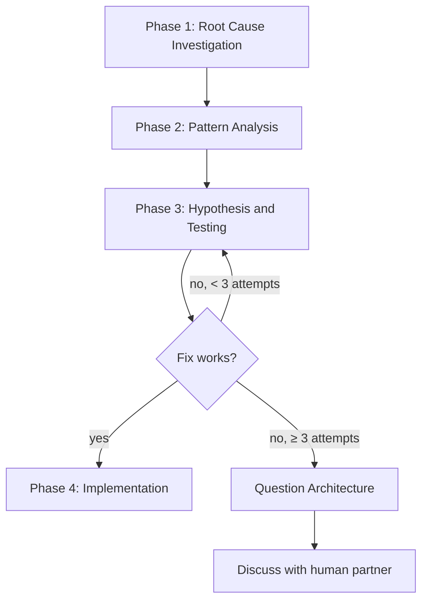

# Systematic Debugging

## Overview

Random fixes waste time and create new bugs. Quick patches mask underlying issues.

**Core principle:** ALWAYS find root cause before attempting fixes. Symptom fixes are failure.

**Violating the letter of this process is violating the spirit of debugging.**

## The Iron Law

```
NO FIXES WITHOUT ROOT CAUSE INVESTIGATION FIRST
```

If you haven't completed Phase 1, you cannot propose fixes.

## When to Use

Use for ANY technical issue:
- Test failures
- Bugs in production
- Unexpected behavior
- Performance problems
- Build failures
- Integration issues

**Use this ESPECIALLY when:**
- Under time pressure (emergencies make guessing tempting)
- "Just one quick fix" seems obvious
- You've already tried multiple fixes
- Previous fix didn't work
- You don't fully understand the issue

**Don't skip when:**
- Issue seems simple (simple bugs have root causes too)
- You're in a hurry (rushing guarantees rework)
- Manager wants it fixed NOW (systematic is faster than thrashing)

## The Four Phases



You MUST complete each phase before proceeding to the next.

### Phase 1: Root Cause Investigation

**BEFORE attempting ANY fix:**

0. **Search the Knowledge Garden**
   - Run forage SEARCH with keywords from the error message or failure pattern
   - A garden entry might document this exact bug or a known gotcha
   - If a match exists, read it before investigating further — it may save the entire investigation

1. **Read Error Messages Carefully**
   - Don't skip past errors or warnings
   - They often contain the exact solution
   - Read stack traces completely
   - Note line numbers, file paths, error codes

2. **Reproduce Consistently**
   - Can you trigger it reliably?
   - What are the exact steps?
   - Does it happen every time?
   - If not reproducible, gather more data — don't guess

3. **Check Recent Changes**
   - What changed that could cause this?
   - Git diff, recent commits
   - New dependencies, config changes
   - Environmental differences

4. **Gather Evidence in Multi-Component Systems**

   When the system has multiple components (CI → build → signing, API → service → database):

   Before proposing fixes, add diagnostic instrumentation at each component boundary:
   - Log what data enters the component
   - Log what data exits the component
   - Verify environment/config propagation
   - Check state at each layer

   Run once to gather evidence showing WHERE it breaks, then investigate that specific component.

5. **Trace Data Flow**

   When the error is deep in the call stack, trace backward to find the original trigger.

   See [root-cause-tracing.md](root-cause-tracing.md) for the complete backward tracing technique.

   **Quick version:**
   - Where does the bad value originate?
   - What called this with the bad value?
   - Keep tracing up until you find the source
   - Fix at source, not at symptom

   **Tooling:** Use ide-tooling for all code tracing — `ide_call_hierarchy`
   to trace callers/callees, `ide_find_references` to find all usages,
   `ide_find_definition` to navigate to declarations,
   `ide_type_hierarchy` to understand inheritance chains. Never use bash
   grep for tracing data flow — grep matches text, the IDE understands
   symbol relationships, type hierarchies, and call chains.

6. **Check for Multiple Independent Root Causes**
   - If investigation reveals 2+ independent failures (different subsystems, different root causes), use dispatching-parallel-agents to investigate concurrently
   - Don't fix them sequentially when they can be diagnosed in parallel

### Phase 2: Pattern Analysis

**Find the pattern before fixing:**

1. **Find Working Examples**
   - Locate similar working code in the same codebase (use `ide_find_symbol`, `ide_find_class`)
   - What works that's similar to what's broken?

2. **Compare Against References**
   - If implementing a pattern, read the reference implementation COMPLETELY
   - Don't skim — read every line
   - Understand the pattern fully before applying

3. **Identify Differences**
   - What's different between working and broken?
   - List every difference, however small
   - Don't assume "that can't matter"

4. **Understand Dependencies**
   - What other components does this need?
   - What settings, config, environment?
   - What assumptions does it make?

### Phase 3: Hypothesis and Testing

**Scientific method:**

1. **Form Single Hypothesis**
   - State clearly: "I think X is the root cause because Y"
   - Write it down
   - Be specific, not vague

2. **Test Minimally**
   - Make the SMALLEST possible change to test the hypothesis
   - One variable at a time
   - Don't fix multiple things at once

3. **Verify Before Continuing**
   - Did it work? Yes → Phase 4
   - Didn't work? Form NEW hypothesis
   - DON'T add more fixes on top

4. **When You Don't Know**
   - Say "I don't understand X"
   - Don't pretend to know
   - Ask for help
   - Research more

### Phase 4: Implementation

**Fix the root cause, not the symptom:**

1. **Create Failing Test Case**
   - Write a failing test that reproduces the bug
   - Use the test-driven-development skill's bug fix workflow: failing test → verify it fails for the right reason → fix → verify pass
   - MUST have a failing test before fixing

2. **Implement Single Fix**
   - Address the root cause identified
   - ONE change at a time
   - No "while I'm here" improvements
   - No bundled refactoring
   - Use ide-tooling for structural edits: `ide_replace_member` for fixing implementations, `ide_insert_member` for adding validation layers

3. **Verify Fix**
   - Test passes now?
   - No other tests broken?
   - Issue actually resolved?

4. **If Fix Doesn't Work**
   - STOP
   - Count: How many fixes have you tried?
   - If < 3: Return to Phase 1, re-analyze with new information
   - **If ≥ 3: STOP and question the architecture (step 5 below)**
   - DON'T attempt Fix #4 without architectural discussion

5. **If 3+ Fixes Failed: Question Architecture**

   Pattern indicating architectural problem:
   - Each fix reveals new shared state/coupling in a different place
   - Fixes require massive refactoring to implement
   - Each fix creates new symptoms elsewhere

   STOP and question fundamentals:
   - Is this pattern fundamentally sound?
   - Are we sticking with it through sheer inertia?
   - Should we refactor architecture vs. continue fixing symptoms?

   **Discuss with your human partner before attempting more fixes.**

   This is NOT a failed hypothesis — this is a wrong architecture.

6. **After Fixing — Capture Knowledge**
   - If the root cause was non-obvious (symptoms misleading, tools contradicting docs, silent failures), use forage CAPTURE to record the gotcha
   - Future sessions can find this via forage SEARCH in Phase 1

## Red Flags — STOP and Follow Process

If you catch yourself thinking:
- "Quick fix for now, investigate later"
- "Just try changing X and see if it works"
- "Add multiple changes, run tests"
- "Skip the test, I'll manually verify"
- "It's probably X, let me fix that"
- "I don't fully understand but this might work"
- "Pattern says X but I'll adapt it differently"
- "Here are the main problems: [lists fixes without investigation]"
- Proposing solutions before tracing data flow
- **"One more fix attempt" (when already tried 2+)**
- **Each fix reveals new problem in different place**

**ALL of these mean: STOP. Return to Phase 1.**

**If 3+ fixes failed:** Question the architecture (see Phase 4 Step 5)

## Your Human Partner's Signals You're Doing It Wrong

Watch for these redirections:
- "Is that not happening?" — You assumed without verifying
- "Will it show us...?" — You should have added evidence gathering
- "Stop guessing" — You're proposing fixes without understanding
- "Ultra-think this" — Question fundamentals, not just symptoms
- "We're stuck?" (frustrated) — Your approach isn't working

**When you see these:** STOP. Return to Phase 1.

## Common Rationalizations

| Excuse | Reality |
|--------|---------|
| "Issue is simple, don't need process" | Simple issues have root causes too. Process is fast for simple bugs. |
| "Emergency, no time for process" | Systematic debugging is FASTER than guess-and-check thrashing. |
| "Just try this first, then investigate" | First fix sets the pattern. Do it right from the start. |
| "I'll write test after confirming fix works" | Untested fixes don't stick. Test first proves it. |
| "Multiple fixes at once saves time" | Can't isolate what worked. Causes new bugs. |
| "Reference too long, I'll adapt the pattern" | Partial understanding guarantees bugs. Read it completely. |
| "I see the problem, let me fix it" | Seeing symptoms ≠ understanding root cause. |
| "One more fix attempt" (after 2+ failures) | 3+ failures = architectural problem. Question pattern, don't fix again. |

## Quick Reference

| Phase | Key Activities | Success Criteria |
|-------|---------------|------------------|
| **1. Root Cause** | Forage SEARCH, read errors, reproduce, check changes, gather evidence | Understand WHAT and WHY |
| **2. Pattern** | Find working examples, compare | Identify differences |
| **3. Hypothesis** | Form theory, test minimally | Confirmed or new hypothesis |
| **4. Implementation** | Create failing test, fix, verify, capture knowledge | Bug resolved, tests pass |

## When Process Reveals "No Root Cause"

If systematic investigation reveals the issue is truly environmental, timing-dependent, or external:

1. You've completed the process
2. Document what you investigated
3. Implement appropriate handling (retry, timeout, error message)
4. Add monitoring/logging for future investigation

**But:** 95% of "no root cause" cases are incomplete investigation.

## Supporting Techniques

These techniques are part of systematic debugging and available in this directory:

- **[root-cause-tracing.md](root-cause-tracing.md)** — Trace bugs backward through the call stack to find the original trigger
- **[defense-in-depth.md](defense-in-depth.md)** — Add validation at multiple layers after finding root cause
- **[condition-based-waiting.md](condition-based-waiting.md)** — Replace arbitrary timeouts with condition polling

## Real-World Impact

From debugging sessions:
- Systematic approach: 15–30 minutes to fix
- Random fixes approach: 2–3 hours of thrashing
- First-time fix rate: 95% vs 40%
- New bugs introduced: Near zero vs common

## Skill Chaining

**The debugging toolkit:** Three skills covering the debugging spectrum:
- `systematic-debugging` (this skill) — single root cause investigation
- `dispatching-parallel-agents` — multiple independent root causes, investigated concurrently
- `fix-ci` — CI-specific failures (local reproduction, CI-specific patterns)

**Invoked by:**
- `using-superpowers` — process skill gate: "no fix without root cause"

**Complements:**
- `test-driven-development` — Phase 4 uses TDD's bug fix workflow (failing test → fix → verify). TDD defines HOW to write the regression test; this skill defines WHEN and WHY.
- `verification-before-completion` — after the fix, verify the whole before claiming done.
- `ide-tooling` — Phase 1 uses Navigate tools for code tracing. Phase 4 uses Edit tools for structural fixes.
- `dispatching-parallel-agents` — Phase 1 Step 6: when investigation reveals 2+ independent root causes, dispatch parallel agents.
- `fix-ci` — for CI-specific failures, use fix-ci which specialises in local reproduction and CI-specific patterns.
- `forage` — Phase 1 Step 0: SEARCH for known gotchas. Phase 4 Step 6: CAPTURE non-obvious root causes.
