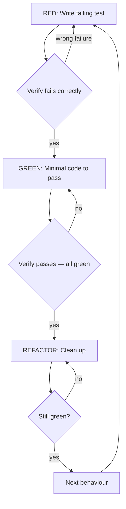

# Test-Driven Development (TDD)

## Overview

Write the test first. Watch it fail. Write minimal code to pass.

**Core principle:** If you didn't watch the test fail, you don't know if it tests the right thing.

**Violating the letter of the rules is violating the spirit of the rules.**

## When to Use

**Always:**
- New features
- Bug fixes
- Refactoring
- Behavior changes

**Exceptions (ask your human partner):**
- Throwaway prototypes
- Generated code
- Configuration files

Thinking "skip TDD just this once"? Stop. That's rationalization.

## The Iron Law

```
NO PRODUCTION CODE WITHOUT A FAILING TEST FIRST
```

Write code before the test? Delete it. Start over.

**No exceptions:**
- Don't keep it as "reference"
- Don't "adapt" it while writing tests
- Don't look at it
- Delete means delete

Implement fresh from tests. Period.

## Red-Green-Refactor



### RED — Write Failing Test

Write one minimal test showing what should happen.

**Requirements:**
- One behaviour per test
- Clear name that describes the expected behaviour
- Real code, not mocks (mock only what is unavoidable: external I/O, network, slow services)
- Use `ide_insert_member` to add test methods structurally

**The test name IS the specification.** "rejects empty email" tells you
exactly what the code should do. "test1" tells you nothing.

### Verify RED — Watch It Fail

**MANDATORY. Never skip.**

Run the test. Confirm:
- Test fails (not errors — compilation errors mean the test is broken, not failing)
- Failure message matches what you expect
- Fails because the feature is missing, not because of typos or setup

**Test passes immediately?** You're testing existing behaviour. Fix the test.
**Test errors?** Fix the error, re-run until it fails correctly.

### GREEN — Minimal Code

Write the simplest code that makes the test pass.

- Use `ide_insert_member` for new methods, `ide_replace_member` to fix existing ones
- Don't add features beyond what the test requires
- Don't refactor yet
- Don't "improve" code that isn't being tested

**YAGNI:** If the test doesn't ask for it, don't build it.

### Verify GREEN — Watch It Pass

**MANDATORY.**

Run the test. Confirm:
- The new test passes
- All existing tests still pass
- Output is clean (no errors, no warnings)

**New test fails?** Fix the production code, not the test.
**Existing tests break?** Fix them now — don't defer.

### REFACTOR — Clean Up

After green only:
- Remove duplication
- Improve names
- Extract helpers

Keep tests green throughout. Don't add behaviour during refactor.

### Repeat

Next failing test for the next behaviour.

## Good Tests

| Quality | Good | Bad |
|---------|------|-----|
| **Minimal** | One behaviour. "and" in name? Split it. | "validates email and domain and whitespace" |
| **Clear** | Name describes expected behaviour | "test1", "it works" |
| **Shows intent** | Demonstrates desired API | Obscures what code should do |
| **Real** | Tests real implementation | Tests mock existence or mock behaviour |

## Why Order Matters

**"I'll write tests after to verify it works"**

Tests written after code pass immediately. Passing immediately proves
nothing: might test the wrong thing, might test implementation not
behaviour, might miss edge cases. You never saw it catch the bug.

Test-first forces you to see the test fail, proving it actually tests
something.

**"I already manually tested all the edge cases"**

Manual testing is ad-hoc. No record, can't re-run, easy to forget
cases under pressure. Automated tests are systematic — they run the
same way every time.

**"Deleting X hours of work is wasteful"**

Sunk cost fallacy. The time is already gone. Working code without real
tests is technical debt. Delete and rewrite with TDD.

**"TDD is dogmatic, being pragmatic means adapting"**

TDD IS pragmatic. Finds bugs before commit, prevents regressions,
documents behaviour, enables safe refactoring. "Pragmatic" shortcuts
= debugging in production = slower.

**"Tests after achieve the same goals — it's spirit not ritual"**

No. Tests-after answer "what does this do?" Tests-first answer "what
should this do?" Tests-after are biased by your implementation. You
test what you built, not what's required.

## Common Rationalizations

| Excuse | Reality |
|--------|---------|
| "Too simple to test" | Simple code breaks. Test takes 30 seconds. |
| "I'll test after" | Tests passing immediately prove nothing. |
| "Tests after achieve same goals" | Tests-after = "what does this do?" Tests-first = "what should this do?" |
| "Already manually tested" | Ad-hoc ≠ systematic. No record, can't re-run. |
| "Deleting X hours is wasteful" | Sunk cost fallacy. Keeping unverified code is technical debt. |
| "Keep as reference, write tests first" | You'll adapt it. That's testing after. Delete means delete. |
| "Need to explore first" | Fine. Throw away exploration, start with TDD. |
| "Test hard = design unclear" | Listen to test. Hard to test = hard to use. |
| "TDD will slow me down" | TDD faster than debugging. |
| "Manual test faster" | Manual doesn't prove edge cases. You'll re-test every change. |
| "Existing code has no tests" | You're improving it. Add tests for what you change. |

## Red Flags — STOP and Start Over

- Code before test
- Test after implementation
- Test passes immediately
- Can't explain why test failed
- Tests added "later"
- Rationalizing "just this once"
- "I already manually tested it"
- "Keep as reference" or "adapt existing code"
- "This is different because..."

**All of these mean: Delete code. Start over with TDD.**

## Bug Fix Workflow

1. Write a failing test that reproduces the bug
2. Verify it fails for the right reason (the bug)
3. Fix the bug — minimal code
4. Verify the test passes
5. Verify all other tests still pass
6. The test is now a regression guard

Never fix bugs without a test.

## Verification Checklist

Before marking work complete:

- [ ] Every new function/method has a test
- [ ] Watched each test fail before implementing
- [ ] Each test failed for expected reason (feature missing, not typo)
- [ ] Wrote minimal code to pass each test
- [ ] All tests pass
- [ ] Output clean (no errors, warnings)
- [ ] Tests use real code (mocks only if unavoidable)
- [ ] Coverage is comprehensive, not just happy path:
  - Correctness (right output for valid input)
  - Boundary values (at threshold, one below, one above)
  - Edge cases (empty input, single element, zero-duration)
  - Error/failure paths (null returns, exceptions, invalid input)
  - Robustness (network failures, timeouts, malformed input)
  - Validation (reject invalid arguments)
  - Branch coverage (every new if/else and early return has a test)
  - Concurrency (if thread-safe by design, prove it)

Can't check all boxes? You skipped TDD. Start over.

## When Stuck

| Problem | Solution |
|---------|----------|
| Don't know how to test | Write wished-for API. Write assertion first. Ask your human partner. |
| Test too complicated | Design too complicated. Simplify interface. |
| Must mock everything | Code too coupled. Use dependency injection. |
| Test setup huge | Extract helpers. Still complex? Simplify design. |

## Testing Anti-Patterns

When adding mocks or test utilities, read [testing-anti-patterns.md](testing-anti-patterns.md) to avoid common pitfalls:
- Testing mock behaviour instead of real behaviour
- Adding test-only methods to production classes
- Mocking without understanding dependencies
- Incomplete mocks that hide structural assumptions

## Final Rule

```
Production code → test exists and failed first
Otherwise → not TDD
```

No exceptions without your human partner's permission.

## Skill Chaining

**Process layer:** This skill defines HOW to work (test first, watch
fail, minimal code, refactor). Language-specific skills define WHAT
tools to use:
- `java-dev` — JUnit 5, AssertJ, @QuarkusTest, real CDI over Mockito
- `ts-dev` — Jest/Vitest, real implementations over MSW
- `python-dev` — pytest, fixtures, parametrize, real in-memory over mocks

**Foundational reading:** `~/.hortora/garden/approaches/testing.md` —
universal testing principles referenced by all three language skills.

**Pipeline integration:** During `subagent-driven-development` or
`executing-plans`, every implementation task follows TDD. The execution
skills reference TDD as methodology — they don't Skill-tool invoke it, but implementers follow its red-green-refactor cycle.

**IDE integration:** Use `ide-tooling` for structural editing during
the red-green-refactor cycle:
- `ide_insert_member` — add new test methods (RED phase)
- `ide_replace_member` — fix implementations (GREEN phase)
- `ide_file_structure` — find existing test methods to understand coverage

**Complements:**
- `verification-before-completion` — TDD verifies each unit.
  VBC verifies the whole before completion claims.
- `systematic-debugging` — bug found → write failing test (this skill's
  bug fix workflow) → then apply root-cause methodology.
- `dispatching-parallel-agents` — concurrent investigation uses TDD per agent
- `writing-plans` — plans reference TDD as the implementation methodology
- `writing-skills` — skill testing follows the same red-green-refactor cycle
